# Nested Form Builder ユーザーマニュアル

**バージョン**: 2.4
**最終更新**: 2026年2月18日

---

## 目次

1. [はじめに](#はじめに)
2. [画面構成](#画面構成)
3. [フォームを作成する](#フォームを作成する)
4. [フォームを管理する](#フォームを管理する)
5. [データを管理する](#データを管理する)
6. [よくある質問](#よくある質問)
7. [トラブルシューティング](#トラブルシューティング)

---

## はじめに

### Nested Form Builderとは

Nested Form Builderは、階層構造を持つアンケートフォームを視覚的に作成できるWebアプリケーションです。プログラミングの知識がなくても、直感的な操作でフォームを作成し、回答をGoogle Sheetsに自動保存できます。

### 主な機能

- **ビジュアルエディタ**: 直感的な操作で簡単にフォームを作成
- **多段構造**: 条件に応じて次の質問を表示（最大6階層）
- **多様な質問タイプ**: テキスト、数値、日付、選択肢、チェックボックス、メッセージなど
- **Google Sheets連携**: 回答を自動的にスプレッドシートに保存
- **高度な検索機能**: AND/OR検索、比較演算、正規表現をサポート
- **データ管理**: インポート・エクスポート、アーカイブ機能
- **スタイル設定**: フィールドごとに文字サイズ・色をカスタマイズ可能
- **表示モード**: 通常/コンパクト/非表示の3種類のモード
- **パフォーマンス最適化**: IndexedDBキャッシュによる高速データ取得

### システム要件

- **ブラウザ**: Google Chrome、Firefox、Safari、Edge（最新版推奨）
- **Googleアカウント**: Google Sheetsにデータを保存するために必要
- **インターネット接続**: フォームの保存・取得時に必要

### アクセス方法

Nested Form Builderは、Google Apps ScriptでデプロイされたWebアプリケーションです。

1. 管理者から提供されたWebアプリURLにアクセス
   - 例: `https://script.google.com/macros/s/AKfycbz.../exec`


> **💡 ヒント**: URLをブックマークしておくと、次回から簡単にアクセスできます。

---

## 画面構成

アプリケーションは以下の6つの画面で構成されています。

### 2.1 フォーム一覧画面

ブラウザでアクセスすると最初に表示されるメイン画面です。

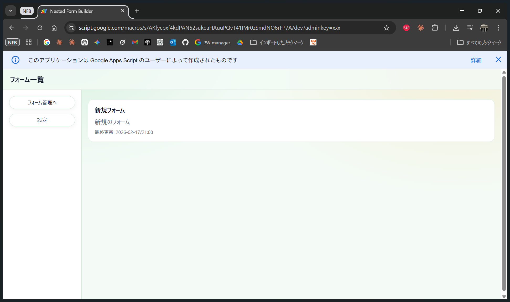

| エリア | 説明 |
|--------|------|
| **左サイドバー** | 「フォーム管理へ」「設定」ボタン |
| **メインエリア** | 作成済みフォームがカード形式で一覧表示 |

- 各フォームカードには**フォーム名**、**説明**、**最終更新(UNIX ms)**が表示されます
- フォームカードをクリックすると検索画面に移動します
- 「フォーム管理へ」ボタンでフォーム管理画面に移動します

### 2.2 設定画面

フォーム一覧画面の左サイドバーにある「設定」ボタンから開きます。

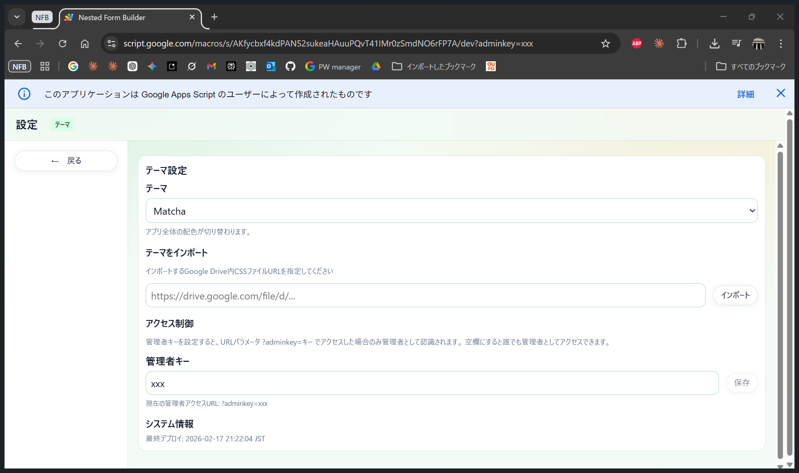

| 設定項目 | 説明 |
|----------|------|
| **テーマ設定** | ドロップダウンからアプリ全体の配色テーマを選択 |
| **テーマをインポート** | Google DriveまたはローカルのCSSファイルURLを指定してカスタムテーマをインポート |
| **管理者キー** | 管理者権限でアクセスするためのキーを設定（空欄の場合は誰でも管理者） |
| **システム情報** | 最終デプロイ日時の確認 |

管理者キーを設定した場合、URLパラメーター `?adminkey=キー` でアクセスした場合のみ管理者として認識されます。

### 2.3 フォーム管理画面

「フォーム管理へ」ボタンから開きます。フォームの作成・編集・管理を行う画面です。

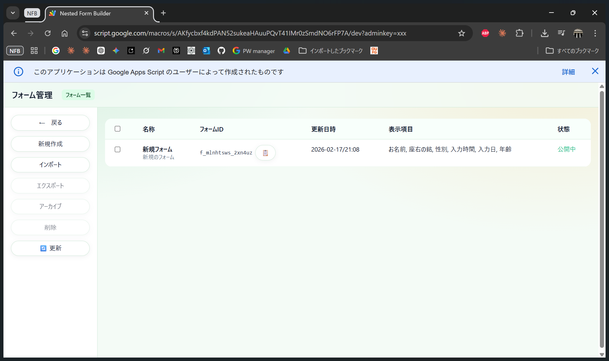

**左サイドバーのアクションボタン**:

| ボタン | 機能 |
|--------|------|
| **← 戻る** | フォーム一覧ページに戻る |
| **新規作成** | 新しいフォームを作成 |
| **インポート** | JSON形式のフォームファイルを読み込み |
| **エクスポート** | 選択したフォームをJSON形式でダウンロード |
| **アーカイブ** | 選択したフォームを非表示化 |
| **削除** | 選択したフォームを完全削除 |
| **🔄 更新** | 一覧表示を最新の状態に更新 |

**メインエリア（フォーム一覧テーブル）**:

| 列名 | 説明 |
|------|------|
| **名称** | フォーム名と説明 |
| **フォームID** | 一意の識別子（クリップボードにコピー可能） |
| **更新日時** | 最終更新(UNIX ms) |
| **表示項目** | 検索画面に表示される質問項目 |
| **状態** | 「公開中」「非公開」など |

### 2.4 フォーム編集画面

フォーム管理画面で「新規作成」またはフォーム名をクリックすると開きます。

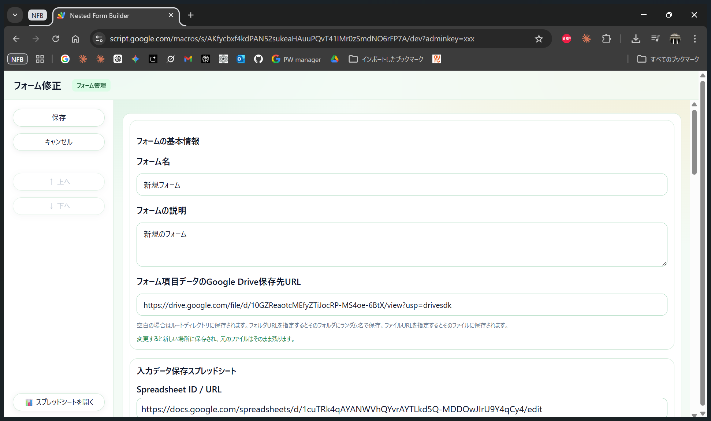

| エリア | 説明 |
|--------|------|
| **上部** | フォーム名、説明、Google Drive保存先URLなどの基本情報 |
| **中央左側** | 質問項目の階層表示 |
| **中央右側** | 選択した項目の詳細設定 |
| **下部** | 保存、キャンセル、プレビューボタン |
| **左サイドバー** | 保存、キャンセル、↑上へ/↓下へ、📊 スプレッドシートを開く |

### 2.5 検索画面（データ管理）

フォーム一覧画面でフォームカードをクリックすると表示されます。

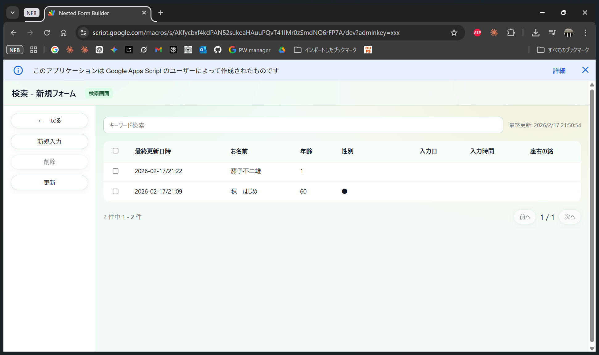

**左サイドバー**:

| ボタン | 機能 |
|--------|------|
| **← 戻る** | フォーム一覧ページに戻る |
| **新規入力** | フォーム入力画面を開く |
| **削除** | 選択されたレコードを削除（複数選択可能） |
| **更新** | 最新データを取得して表示を更新 |

**メインエリア**:
- キーワード検索ボックス
- 最終更新日時の表示
- データテーブル（チェックボックス、最終更新日時、各質問項目）
- ページネーション

### 2.6 フォーム入力画面

検索画面の「新規入力」ボタン、またはテーブルのレコードをクリックすると開きます。

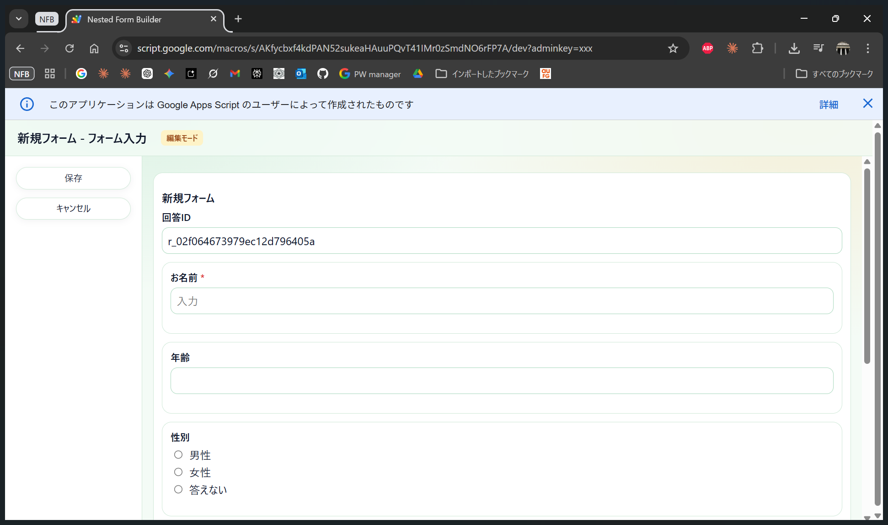

| エリア | 説明 |
|--------|------|
| **左サイドバー** | 保存、キャンセルボタン |
| **メインエリア** | フォーム設計時に定義された質問項目がフォーム形式で表示 |

- 自動生成された回答ID（編集不可）が表示されます
- 必須項目には「*」マークが表示されます
- メッセージタイプのフィールドは入力不要（情報表示のみ）
- 設定したスタイル（文字色、サイズ）が適用されます
- ネスト構造・条件分岐により、選択に応じて子質問が動的に表示/非表示になります

---

## フォームを作成する

### 3.1 基本情報の設定

1. フォーム管理画面で **「新規作成」** をクリック
2. フォーム編集画面で以下を入力します：

| 設定項目 | 説明 |
|----------|------|
| **フォーム名** | フォームの識別名（例: 「顧客満足度調査」） |
| **フォームの説明** | フォームの目的や概要（任意） |
| **Google Drive保存先URL** | フォームデータの保存先（下記参照） |

**Google Drive保存先URL の動作**:
- **空白**: ルートディレクトリに保存（後で移動可能）
- **フォルダURL**: そのフォルダ内に適当なファイル名で保存
- **ファイルURL**: そのファイルに保存

### 3.2 Google Sheets連携

フォームの回答を保存するGoogle Sheetsを設定します。

1. Google Sheetsで新しいスプレッドシートを作成
2. **Spreadsheet ID / URL** フィールドに以下のいずれかの形式で貼り付け：
   - フルURL: `https://docs.google.com/spreadsheets/d/1Lj48NIuhyyc85MmrkxDjGnmTNQbxcAjUJf6Gu3faH-M/edit`
   - スプレッドシートID: `1Lj48NIuhyyc85MmrkxDjGnmTNQbxcAjUJf6Gu3faH-M`
3. **Sheet Name** を指定（デフォルト: `Data`）

> **💡 ヒント**: スプレッドシートIDは、Google SheetsのURLの `/d/` と `/edit` の間にある長い文字列です。

### 3.3 検索画面の設定

| 設定項目 | 説明 |
|----------|------|
| **1画面あたりの表示件数** | 検索結果の1ページあたりの表示件数（デフォルト: 20） |
| **検索結果テーブルの最大幅（px）** | テーブルの最大幅（空白で可変幅） |
| **検索結果セルの表示文字数上限** | セル内の文字数上限（任意） |

### 3.4 質問の追加と編集

#### 質問の追加

1. フォーム編集画面で **「質問を追加」** をクリック
2. 質問カードが表示され、以下を設定できます：

| 設定項目 | 説明 |
|----------|------|
| **項目名** | ユーザーに表示される質問のタイトル（必須） |
| **タイプ** | 質問の入力形式（[3.5 質問タイプ一覧](#35-質問タイプ一覧)を参照） |
| **必須** | チェックを入れると回答必須 |
| **表示** | 検索結果への表示方法（[表示モード](#表示モード)を参照） |

#### 質問カードの操作ボタン

| ボタン | 機能 |
|--------|------|
| **削除** | その質問を削除（子質問も一緒に削除。取り消し不可） |
| **次の質問を追加** | 現在の質問の後に新しい質問を追加 |
| **↑上へ / ↓下へ** | 質問の表示順序を入れ替え |

#### 表示モード

質問の「表示」設定で、検索結果テーブルへの表示方法を制御します。

| モード | 説明 |
|--------|------|
| **表示ON（normal）** | 検索結果テーブルに通常表示 |
| **コンパクト（compact）** | 省スペースで表示（一部のタイプで利用可能） |
| **表示OFF（none）** | フォーム入力は可能だが、検索結果には非表示 |

> **💡 用途**: 「表示OFF」は、自動計算される値やタイムスタンプなど、一覧表示が不要な項目に便利です。

### 3.5 質問タイプ一覧

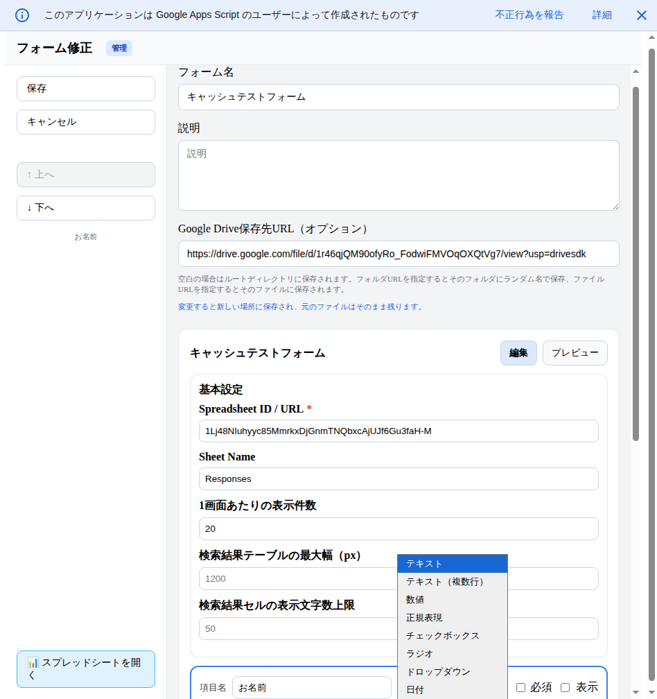

| タイプ | 説明 | 使用例 |
|--------|------|--------|
| **テキスト** | 1行の短いテキスト入力 | 名前、メールアドレス |
| **テキスト（複数行）** | 複数行の長文入力 | 意見、コメント |
| **数値** | 数字のみ入力可能 | 年齢、個数 |
| **日付** | 日付選択 | 誕生日、イベント日 |
| **時間** | 時刻選択 | 予約時間 |
| **ラジオ** | 単一選択 | 性別、満足度 |
| **チェックボックス** | 複数選択可能 | 趣味、興味のある分野 |
| **ドロップダウン** | ドロップダウンから選択 | 都道府県 |
| **正規表現** | カスタムバリデーション | 電話番号、郵便番号 |
| **URL** | URLリンク入力 | Webサイト、参考資料リンク |
| **メッセージ** | 説明文の表示（入力不要） | 注意事項、セクション見出し |

### 3.6 質問の詳細設定

#### スタイル設定

「スタイル設定」チェックボックスをオンにすると設定可能です。

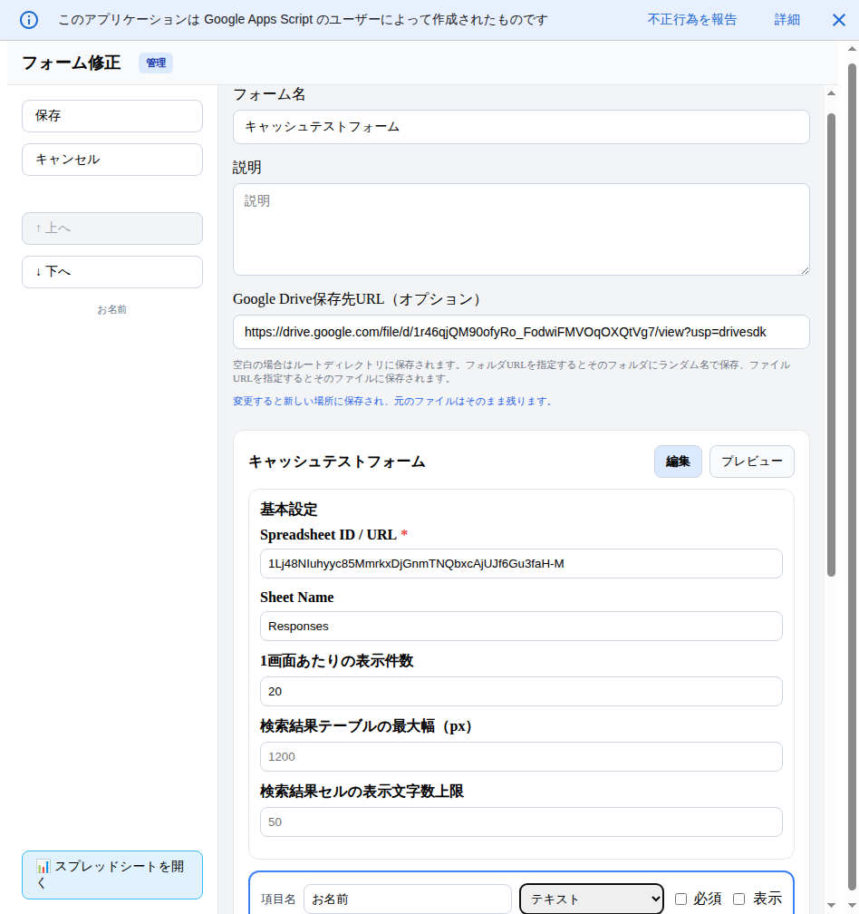

| 設定項目 | 選択肢 |
|----------|--------|
| **文字サイズ** | 小 (12px) / 通常 (14px) / 大 (18px) / 特大 (24px) |
| **文字色** | 黒（デフォルト）/ 赤 / 青 / 緑 / グレー |

#### プレースホルダー設定

「プレースホルダー」チェックボックスをオンにすると、入力欄にヒントテキストを表示できます。

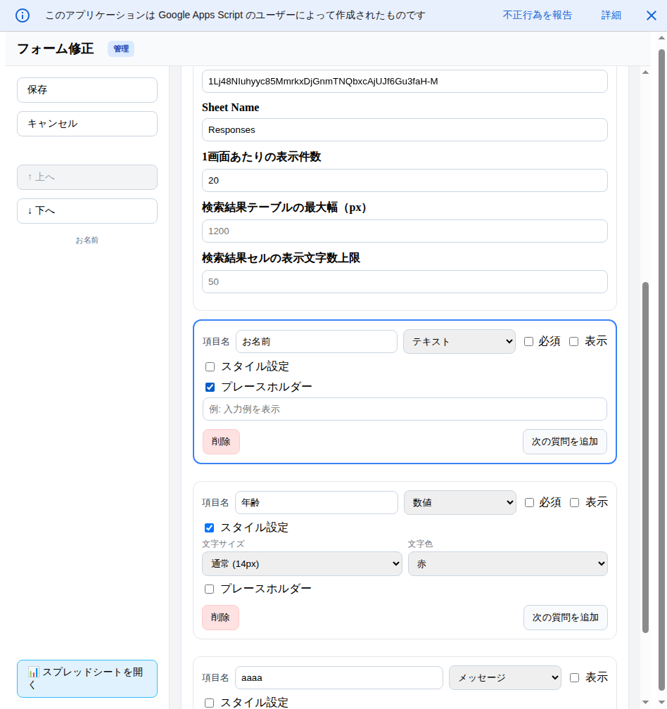

- **対応タイプ**: テキスト、テキスト（複数行）、数値、正規表現、URL
- **例**: 「例: 03-1234-5678」「お名前を入力してください」

#### タイプ別の追加設定

**日付・時間タイプ**:
- 「デフォルトで現在の日付/時刻を自動入力」オプションを設定可能

**正規表現タイプ**:
- カスタムバリデーションパターンを設定
- 例: 電話番号 `^\d{2,4}-\d{2,4}-\d{4}$`、郵便番号 `^\d{3}-\d{4}$`
- パターンに一致しない入力はエラーとして扱われます

**URLタイプ**:
- ブラウザの標準的なURL入力バリデーションが適用
- 検索結果テーブルではクリック可能なリンクとして表示

**選択肢タイプ（ラジオ/チェックボックス/ドロップダウン）**:

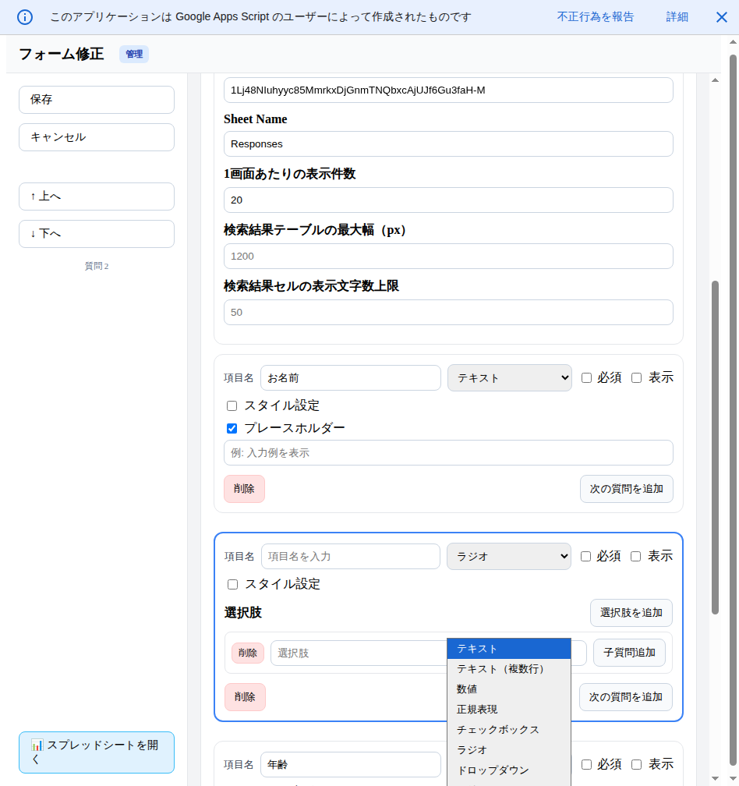

1. 「選択肢」セクションで **「選択肢を追加」** をクリックして選択肢を入力
2. 各選択肢に **「子質問追加」** ボタンが表示され、選択肢ごとに異なる子質問を追加可能
3. 不要な選択肢は **「削除」** ボタンで削除

**メッセージタイプ**:
- 入力不要の説明文やセクション見出しを表示
- スタイル設定のみ可能
- 用途: セクションの区切り、注意事項の表示、説明文の挿入

### 3.7 ネスト構造と条件分岐

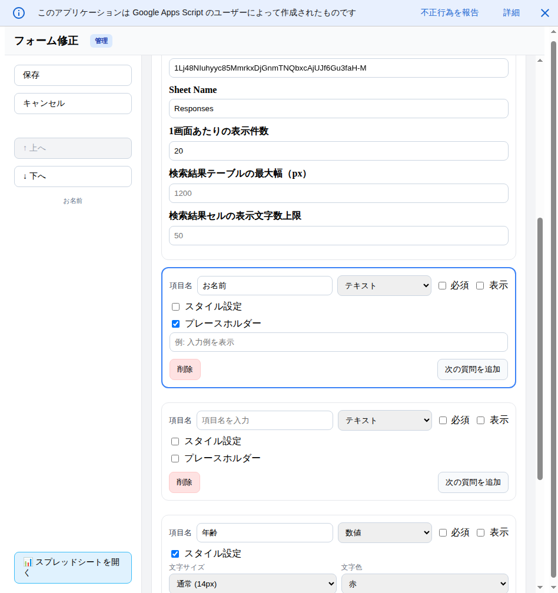

#### 基本的なネスト構造

1. 親質問の **「次の質問を追加」** をクリック
2. 子質問の設定を入力
3. 必要に応じて、さらに孫質問を追加（**最大6階層**まで）

#### 条件分岐の設定

選択肢タイプ（ラジオ/チェックボックス/ドロップダウン）では、**選択肢ごとに異なる子質問**を設定できます。

**設定手順**:
1. 親質問のタイプを選択肢タイプに設定
2. 「選択肢」セクションで選択肢を追加
3. 各選択肢の **「子質問追加」** をクリック
4. その選択肢が選ばれた場合にのみ表示される子質問を設定

**例**: 「好きな果物は？」という質問で：
- 選択肢「リンゴ」→ 子質問「どれくらい食べる？」
- 選択肢「みかん」→ 子質問「何個食べる？」（さらに選択肢を設定可）
- 選択肢「ぶどう」→ 子質問なし

**動作**:
- ユーザーが「リンゴ」を選択した場合のみ、対応する子質問が表示されます
- チェックボックスの場合、複数の選択肢に対応する子質問が同時に表示されます
- 条件に合わない子質問は非表示になります

### 3.8 プレビューと保存

#### プレビュー

「プレビュー」ボタンをクリックすると、実際のフォームの見た目を確認できます。

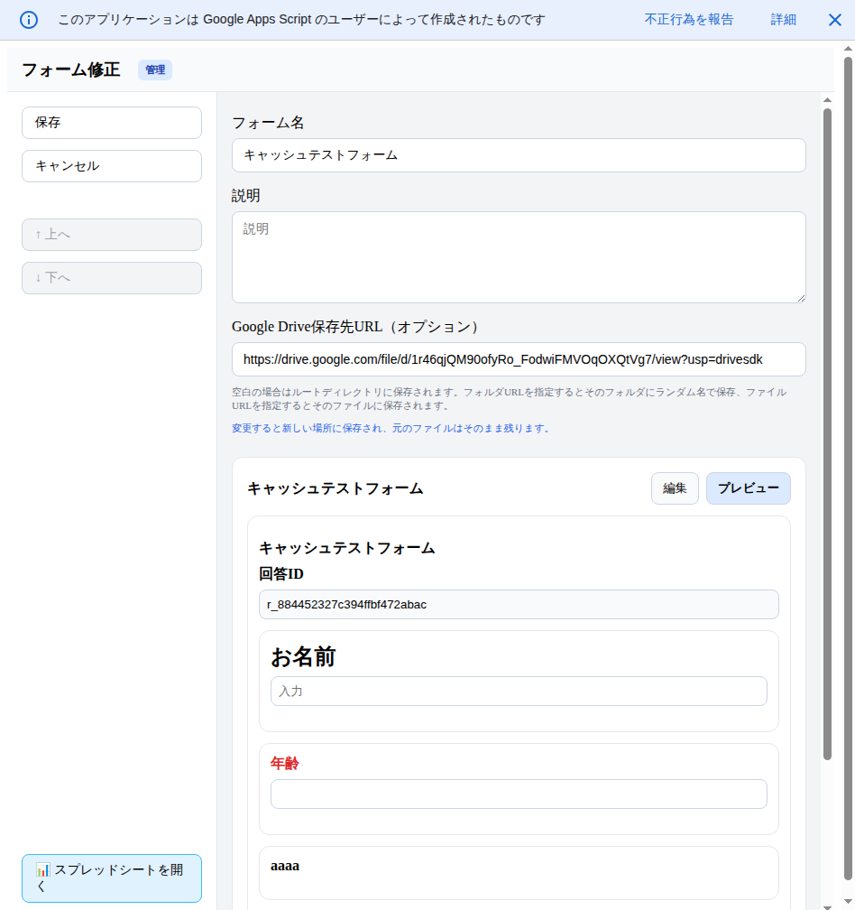

- フォームの見た目を確認
- テスト入力して動作確認
- 検索プレビューで表示項目を確認

#### 保存

1. すべての設定が完了したら **「保存」** をクリック
2. 確認メッセージが表示されます
3. 管理画面に戻り、フォーム一覧に追加されます

---

## フォームを管理する

フォーム管理画面の左サイドバーから、以下の操作を行えます。

### エクスポート

1. フォーム一覧でエクスポートしたいフォームのチェックボックスを選択
2. **「エクスポート」** をクリック
3. JSON形式のフォーム定義ファイルがダウンロードされます

バックアップや他の環境への移行に利用できます。

### インポート

1. **「インポート」** をクリック
2. JSON形式のフォームファイルを選択
3. 既存のフォームと同じIDの場合、上書き確認が表示されます

バックアップからの復元や、他の環境からのフォーム移行に便利です。

### アーカイブ

1. アーカイブしたいフォームのチェックボックスを選択
2. **「アーカイブ」** をクリック
3. フォーム一覧から非表示になります（データは保持されます）

完全削除よりも安全にフォームを整理できます。

### 削除

1. 削除したいフォームのチェックボックスを選択
2. **「削除」** をクリック
3. 確認ダイアログで確認

> ⚠️ **注意**: 削除したフォームは復元できません。ただし、関連する回答データ（Google Sheets上のデータ）には影響しません。

---

## データを管理する

### 5.1 データの入力

1. フォーム一覧からフォームを選択して検索画面を開く
2. **「新規入力」** をクリック
3. 表示されたフォームに必要な情報を入力
4. 必須項目（*マーク）はすべて入力必須
5. **「保存」** をクリック
6. 入力内容は自動的にGoogle Sheetsに保存されます

### 5.2 データの検索

#### シンプルなキーワード検索

検索ボックスにキーワードを入力すると、すべての列を対象に検索されます。

```
田中
```

#### 列を指定した検索

`列名:キーワード` の形式で、特定の列だけを検索できます。

```
名前:田中
```

#### 比較演算子を使った検索

数値や日付の範囲を指定できます。

| 演算子 | 意味 | 例 |
|--------|------|-----|
| `=` | 等しい | `年齢=25` |
| `!=` | 等しくない | `性別!=男性` |
| `>` | より大きい | `年齢>30` |
| `>=` | 以上 | `年齢>=18` |
| `<` | より小さい | `年齢<65` |
| `<=` | 以下 | `年齢<=20` |

#### AND/OR検索

複数の条件を組み合わせることができます。

```
年齢>=18 AND 年齢<=65
```

```
性別=男性 OR 性別=女性
```

#### 正規表現検索

パターンマッチングが可能です。

```
電話番号 ~ /^090/
```

> **詳細**: より高度な検索方法は `docs/検索機能の使い方.md` を参照してください。

### 5.3 ソートとページネーション

- **ソート**: 列名をクリックして昇順/降順を切り替え
- **ページネーション**: 画面下部のページ番号で移動
- **表示件数**: フォーム編集画面の検索画面設定で変更可能

### 5.4 データの編集

1. 検索画面のテーブルから、編集したいレコードをクリック
2. フォーム入力画面が表示され、現在の値が読み込まれます
3. 必要な項目を修正
4. **「保存」** をクリックして変更を確定
5. 「最終更新日時」が自動的に更新されます

> 💡 **ヒント**: 編集時も新規入力時と同じバリデーションが適用されます。

### 5.5 データの削除

#### 単一レコードの削除

1. 削除したいレコードのチェックボックスを選択
2. 左サイドバーの **「削除」** をクリック
3. 確認ダイアログで **「削除を確定」** を選択

#### 複数レコードの一括削除

1. 削除したいレコードのチェックボックスを複数選択
2. **「削除」** をクリック
3. 確認ダイアログで **「削除を確定」** を選択

> ⚠️ **注意**: 削除したレコードは復元できません。

---
## とりあえずやってみよう
### 6.1 フォームをつくってみよう

#### 1. フォーム一覧画面（初期画面）で"フォーム管理へ"ボタンを押す
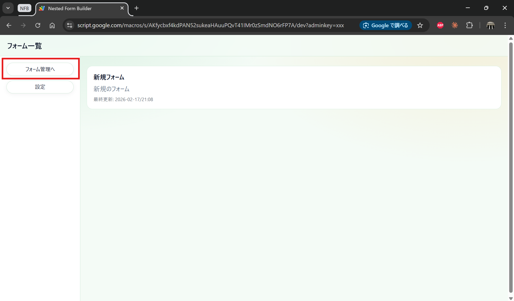
<br><br>

#### 2. "新規作成"ボタンを押す

<br><br>

#### 3. フォームの情報を入れていく（最小限）

- フォーム名を入れる
<br>
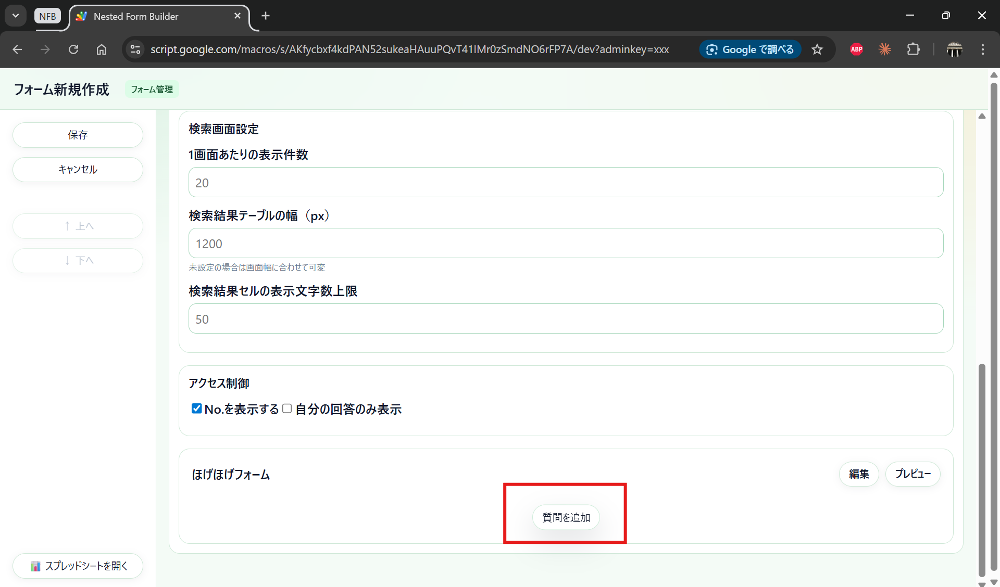
- （一番下の）"質問を追加"ボタンを押す
<br>
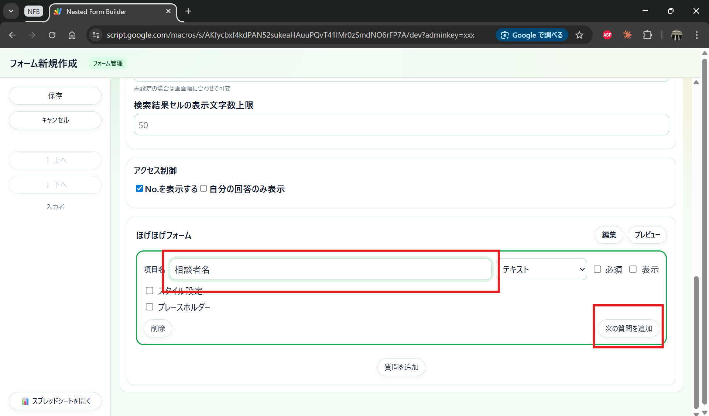
- 項目名に「相談者名」と入れ、"次の質問を追加"ボタンを押す
<br>
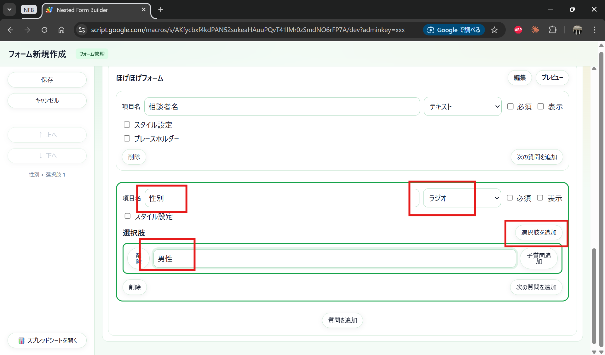
- 項目名に「性別」、種類は「ラジオ」を選択し、選択肢に「男性」を入れ、"選択肢を追加"ボタンを押す
<br>
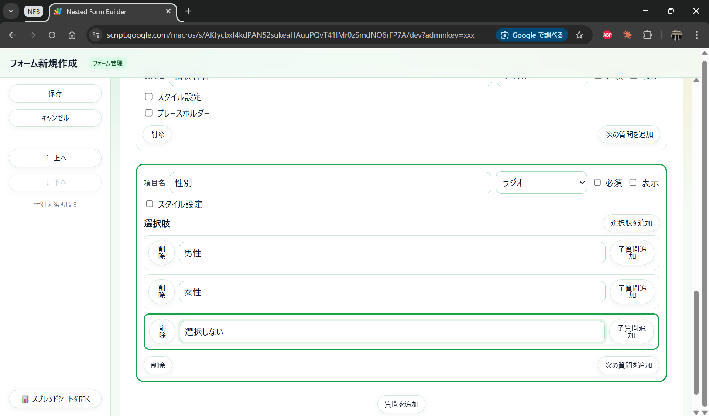
- 選択肢の入力場所が追加されるので同様に「女性」と「選択しない」を追加
- "次の質問を追加"ボタンを押す
<br>
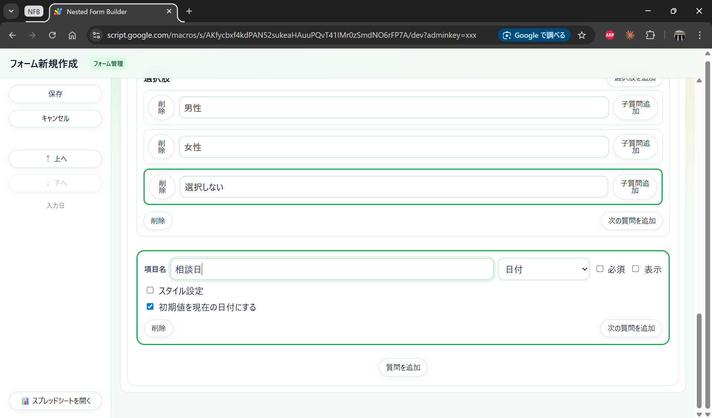
- 次の質問で、項目名：「相談日」、種類：「日付」を選択
- "初期値を現在の日付にする"をチェック（データ新規追加時に入力日が自動で入る）
<br>
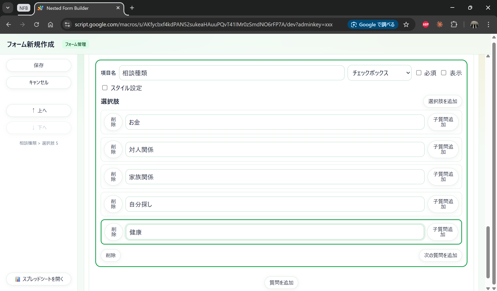
- 次は「チェックボックス」で相談種類を複数入れる
<br>
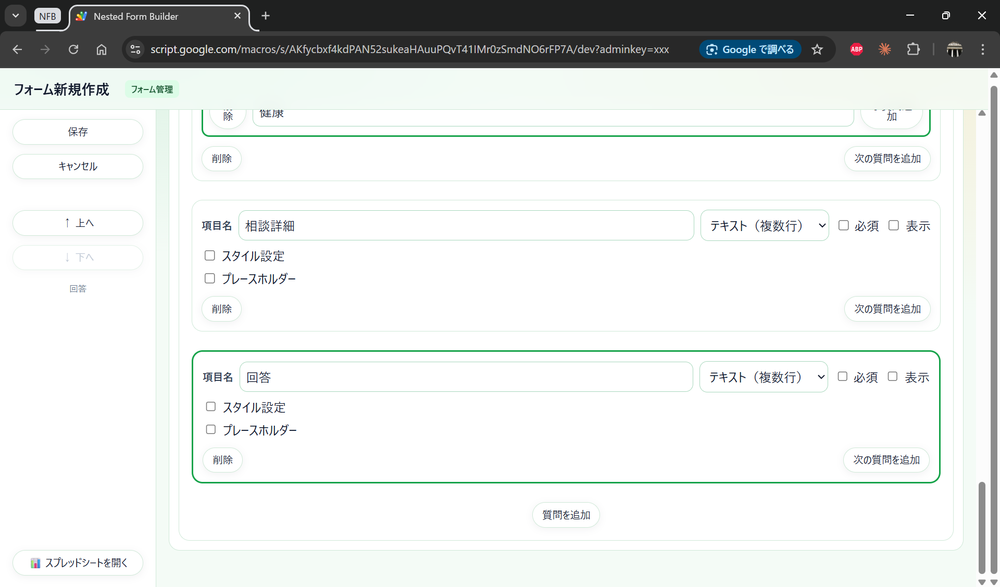
- 相談詳細と回答を追加するが、長くなるので"テキスト(複数行)"とした。
- "保存"ボタンで保存

---

## よくある質問

### Q1. フォームの回答はどこに保存されますか？

設定したGoogle Sheetsに自動的に保存されます。スプレッドシートには以下の形式でデータが記録されています：

- **固定列**: `id`, `No.`, `createdAt`, `modifiedAt`（`createdAt`/`modifiedAt` は UNIX ms）
- **質問列**: 各質問の回答（ネストされた質問は `親質問|子質問` の形式）

### Q2. フォームの階層は何段階まで作成できますか？

最大6階層までネスト可能です。

### Q3. 回答者がインターネット接続なしでフォームに回答できますか？

いいえ、回答の送信にはインターネット接続が必要です。

### Q4. 複数のフォームで同じGoogle Sheetsを使えますか？

技術的には可能ですが、推奨しません。各フォームごとに専用のスプレッドシートを作成することをお勧めします。

### Q5. フォームのデザインをカスタマイズできますか？

スタイル設定機能で、フィールドごとに文字サイズと色をカスタマイズできます。アプリ全体のテーマは設定画面から変更可能です。

### Q6. データをExcelにエクスポートできますか？

Google Sheetsから直接Excelファイルをダウンロードできます：
1. Google Sheetsを開く
2. **ファイル** → **ダウンロード** → **Microsoft Excel (.xlsx)**

### Q7. パフォーマンスが遅いと感じたら？

以下の最適化機能が実装されています：
- **IndexedDBキャッシュ**: フォームデータとレコードをローカルにキャッシュ
- **バックグラウンド更新**: キャッシュを使用しつつ、バックグラウンドで最新データを取得
- **パフォーマンスログ**: コンソールで `window.showPerfSummary()` を実行すると詳細を確認可能

---

## トラブルシューティング

### フォームが保存できない

1. フォーム名が空になっていないか確認
2. スプレッドシートIDが正しいか確認
3. Google Apps Scriptにスプレッドシートへの書き込み権限があるか確認
4. ネットワーク接続を確認
5. ブラウザのコンソール（F12キー）でエラーメッセージを確認

### 回答がGoogle Sheetsに保存されない

1. スプレッドシートの共有設定・アクセス権限を確認
2. GAS Webアプリがデプロイされているか確認
3. フォーム設定のスプレッドシートIDが正しいか確認

### 検索結果が表示されない

1. スプレッドシートに実際にデータがあるか確認
2. 検索クエリの構文を確認（まずシンプルなキーワード検索で試す）
3. **「更新」** ボタンでキャッシュを更新

### インポートしたフォームが正しく動作しない

1. JSONファイルが破損していないか確認（元のファイルを再度エクスポート）
2. 古いバージョンのフォームの場合、互換性の問題がある可能性あり
3. 少なくとも `schema` と `settings` が必要

### ブラウザが遅い・固まる

1. 不要なフォームをアーカイブまたは削除
2. ブラウザを再起動
3. ページネーション設定を小さくする（10件/ページ）
4. ブラウザのIndexedDBをクリア

### テーマの変更が反映されない

1. 強制リロード（Ctrl+Shift+R または Cmd+Shift+R）
2. ブラウザ設定からIndexedDBのデータをクリア
3. 別のブラウザで試す

### レコードが表示されない

1. **「更新」** ボタンで最新データを読み込み
2. 検索ボックスが空になっているか確認（検索条件をクリア）
3. フォーム設定の「Sheet Name」がGoogle Sheetsのシート名と一致しているか確認
4. Google Sheetsを直接開いてレコードが存在するか確認

### カスタムテーマのインポートが失敗する

1. Google DriveのファイルURLが正確か確認
2. CSSファイルに `:root[data-theme="テーマ名"]` セレクタが含まれているか確認
3. Google Apps Scriptの実行権限でGoogle Driveへのアクセスが許可されているか確認
4. CSSの構文エラーがないか確認

### デプロイ後にアクセスできない

1. Google Apps Script管理画面で「アクセスできるユーザー」を「全員」に設定
2. 強制リロード（Ctrl+Shift+R または Cmd+Shift+R）
3. `.gas-deployment.json` ファイルで最新のWebアプリURLを確認

---


## サポート

問題が解決しない場合は、以下の情報を含めて開発チームにお問い合わせください：

- 使用しているブラウザとバージョン
- 発生している問題の詳細な説明
- エラーメッセージ（あれば）
- 問題が発生する手順

---

**最終更新**: 2026年2月18日
**作成**: Nested Form Builder Development Team

