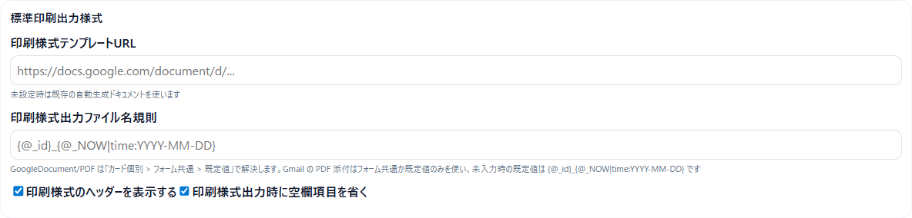
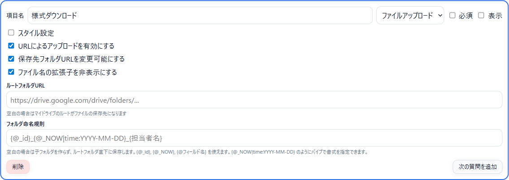
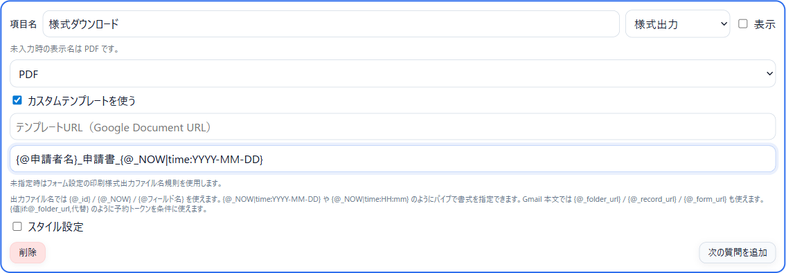
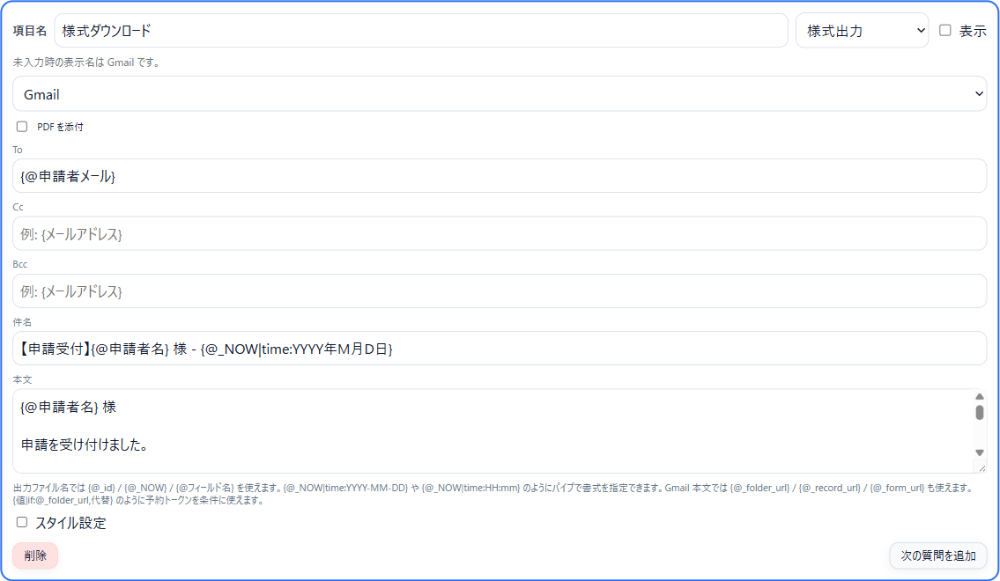
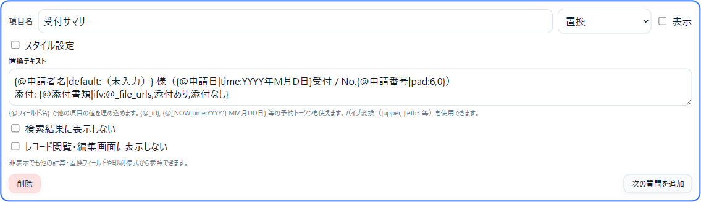
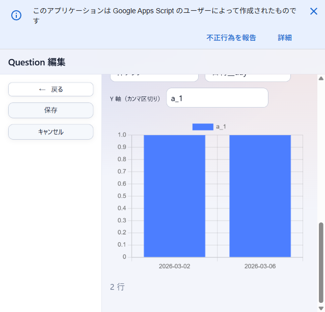
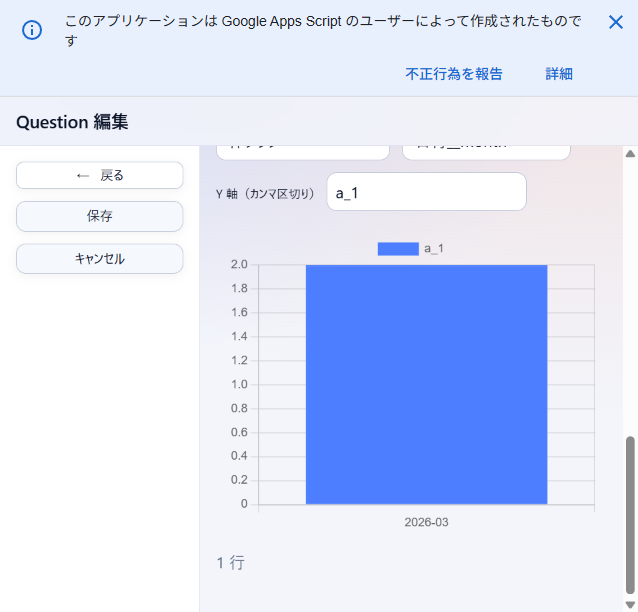
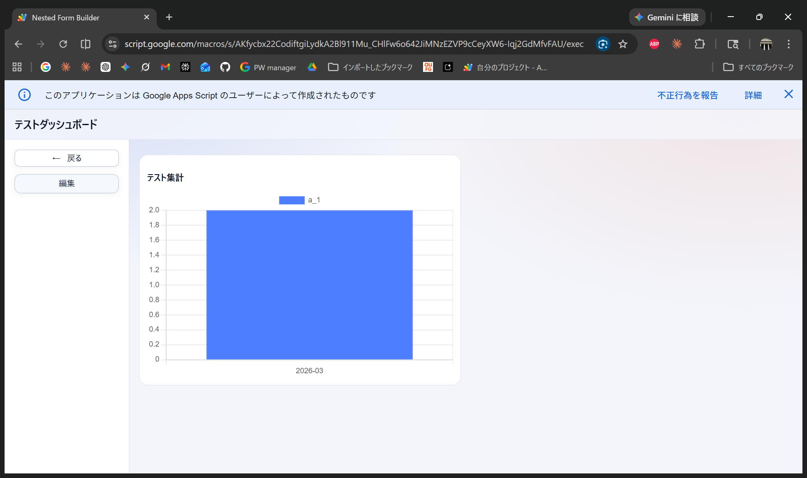

# Nested Form Builder ユーザーマニュアル

**バージョン**: 4.1
**最終更新**: 2026年5月4日

このマニュアルでは、階層フォームの作成から、テンプレートトークン・パイプ変換を使った印刷様式・Gmail 下書き・Drive アップロード先の組み立てまでを扱います。

```text
https://script.google.com/macros/s/AKfycbzEzpdLK7i8Qic0RxycSGuzYbBpoFDd3KSbwDmU1vaUPU0K_fYv0aUL-rYCB1yyLk5yAg/exec
```

本マニュアル内のスクリーンショットは、基本画面は 2026年3月8日 のキャプチャ、テンプレート・Gmail・アップロード周りは 2026年4月19日 のローカル dev 環境のキャプチャです。  
このデプロイでは `User Properties` を使っているため、フォーム一覧や設定はアクセス中の利用者ごとに保持されます。

---

## 1. はじめに

### 1.1 このシステムでできること

Nested Form Builder は、階層構造を持つ入力フォームを作成し、回答を Google スプレッドシートに保存できる Web アプリケーションです。主に次の用途に向いています。

- 申請、相談、受付、報告フォームの作成
- 選択内容に応じて追加質問を表示する分岐フォームの作成
- 保存済みデータの検索、編集、削除、出力
- レコードごとの PDF／Google ドキュメント／Gmail 下書きの生成（**テンプレートトークン + パイプ変換**）
- レコード単位の Google Drive フォルダに添付ファイルを集約
- 入力値を他フィールドから組み立てる「置換」フィールド（`{...}` 式言語と `[...]` ブラケット演算式で文字列・数値計算）
- 保守が終わったフォームの**参照のみ**切替（誤入力防止）

### 1.2 利用前の前提

- 最新版の Chrome / Edge を推奨します
- フォーム作成、Google Drive への保存、Excel 出力では Google アカウント権限が必要です
- フォーム定義は Google Drive、回答データは Google スプレッドシートに保存されます
- 様式出力は Google Docs / Drive / Gmail の権限が必要です

### 1.3 最初に見る画面

最初に開くのは `フォーム一覧` です。ここから `設定` と `フォーム管理`、各フォームの検索画面へ進みます。


- 左側のサイドバーから `設定` と `フォーム管理` を開きます
- 右側には公開中のフォームがカード形式で並びます
- 参照のみに設定されたフォームは名称の右に **【参照のみ】** と表示されます
- カードをクリックすると、そのフォームの検索画面へ移動します

---

## 2. 画面構成

### 2.1 設定

配色テーマや取り込み済みテーマを管理する画面です。


- `テーマ`: 画面全体の配色を切り替えます
- `フォームテーマも一括変更`: ON のとき、現在のテーマをフォーム側にもまとめて反映します
- `テーマをインポート`: Google Drive 上の CSS ファイル URL からカスタムテーマを取り込みます
- `システム情報`: 現在のデプロイ日時を確認できます

### 2.2 管理者設定

管理者キーやメールによるアクセス制御を設定する画面です。

- `管理者キー`: URL パラメータ `?adminkey=キー` でアクセスした場合のみ管理者として認識されます。空欄で制限なしになります
- `管理者メール`: 管理者として認識するメールアドレスを設定します。`;` 区切りで複数指定可（例: `admin1@example.com;admin2@example.com`）。Google Groups のグループアドレスを書くと、そのグループのメンバーも管理者とみなされます
- `一般ユーザーが行ける範囲を個別フォームのみとする`: ON にすると、`?form=xxx` を指定しない一般ユーザーはアクセス拒否されます

### 2.3 フォーム管理

フォーム定義の一覧とメンテナンスを行う画面です。`新規作成` `インポート` `エクスポート` `コピー` `アーカイブ` `参照のみ` `削除` `更新` のアクションが揃っています。


- `新規作成`: 新しいフォームを作成します
- `インポート`: Google Drive の URL からフォーム定義を取り込みます
- `エクスポート`: チェックしたフォームを JSON で出力します
- `コピー`: 既存フォームを複製します（ID だけ新規発行、スキーマはそのまま）
- `アーカイブ`: 一覧から非表示にします
- `参照のみ`: 選択したフォームを参照専用に切り替えます。解除時は同じボタンが「参照のみ解除」として機能し、複数フォームを一括で切り替えられます
- `削除`: 一覧との紐付けを外します（Drive 上の JSON ファイル自体は残ります）
- `更新`: 最新状態を再取得します
- 一覧の行をクリックすると、そのフォームの編集画面を開けます

#### 参照のみモードの挙動

参照のみにしたフォームでは、検索画面から `新規入力` と `編集` が押せなくなり、入力ページも `参照のみ` バッジ付きで閲覧専用になります。運用が終わった申請フォームを履歴として残すときに使います。

### 2.4 Google Drive からのインポート

ファイル URL またはフォルダ URL を入力してフォームを登録します。


- ファイル URL: そのフォームのみ取り込みます
- フォルダ URL: フォルダ内の `.json` をまとめて取り込みます
- すでに登録済みのフォーム ID は自動的にスキップされます

### 2.5 フォーム編集

フォーム名、保存先、検索画面設定、アクセス制御、質問定義をまとめて編集する画面です。


- 上部: フォーム名、説明、Google Drive 保存先 URL
- 中段: 回答保存先スプレッドシート、検索画面設定、**標準印刷出力様式**、レコード画面設定、アクセス制御
- 下段: 質問定義の編集エリア
- 左側: `保存`、`キャンセル`、選択中質問の上下移動、`スプレッドシートを開く`
- 左下: `質問一覧` から編集したい質問位置へ移動できます
- 右下タブ: `編集` / `プレビュー`

### 2.6 基本の質問カード

各質問はカード単位で編集します。


- `項目名`: 入力画面に表示するラベル
- `タイプ`: 入力形式（後述）
- `必須`: 未入力で保存できない項目にします
- `表示`: 検索結果や検索プレビューに出す項目を切り替えます
- `スタイル設定`: 文字サイズや文字色を調整します
- `プレースホルダー`: テキスト系入力欄に入力例を表示します
- `初期値`: テキスト型では「なし／入力者名／入力者所属／入力者役職／自由入力」を横並びで選択できます
- `入力制限`: テキスト型では「なし／最大文字数／パターン指定（正規表現）」を横並びで選択できます
- `次の質問を追加`: 同じ階層の次の質問を追加します

> 項目名・選択肢・プレースホルダーでも `{@…}` トークンと `|` パイプが使えます。例えばラジオ選択肢を `残り{@残席数}席` のように動的にできます。

#### 数値型の追加設定


- `整数のみ`: チェックすると小数を受け付けません
- `最小値` / `最大値`: 入力可能な範囲を制限します（空白で制限なし）

#### 電話番号型の追加設定


- `プレースホルダーを設定する`: 形式設定に連動した入力例を自動生成します
- `入力者の電話番号を自動入力する`: 入力者のアカウント情報から電話番号を自動入力します
- `形式`: **ハイフンあり**（例: `090-1234-5678`）と**ハイフンなし**（例: `09012345678`）を切り替えます
- `固定電話の市外局番省略を認める` / `携帯電話（090/080/070）を許容` / `IP電話（050）を許容` / `フリーダイヤル（0120）を許容`
- `許容パターン（正規表現）`: 現在の設定から自動生成されたバリデーション用正規表現

### 2.7 条件分岐付きの質問

ラジオ、チェックボックス、ドロップダウンでは選択肢ごとに子質問を追加できます。


- `選択肢を追加`: 選択肢を増やします
- `子質問追加`: その選択肢が選ばれたときだけ表示する質問を追加します
- 子質問の中でも、通常の質問と同じようにタイプや必須設定を持てます

### 2.8 プレビュー

保存前に、入力画面と検索プレビューの見え方を確認できます。


### 2.9 検索画面

保存済みデータの一覧表示、検索、削除、出力を行う画面です。


- `新規入力` / `削除` / `更新` / `検索結果を出力`（Excel 保存）/ `設定`
- 参照のみフォームでは `新規入力` `削除` が押せません

### 2.10 フォーム入力画面


- 新規入力時は `保存` / `キャンセル`
- 画面上部に `No.` と `ID`（および参照のみフォームなら `参照のみ` バッジ）が表示されます
- 左側の `既存レコードからコピー` で、レコード ID を指定して内容を流用できます

---

## 3. フォームを作成する

### 3.1 最短手順

1. `フォーム管理` で `新規作成` を押します
2. `フォーム名` を入れます
3. 質問カードを追加・編集します
4. 必要に応じて「標準印刷出力様式」やファイルアップロード設定を入れます
5. `プレビュー` で確認して保存します

### 3.2 基本情報の設定

| 項目 | 説明 |
| --- | --- |
| フォーム名 | 一覧や検索画面に表示される名前 |
| フォームの説明 | フォーム一覧カードの補足文 |
| フォーム項目データの Google Drive 保存先 URL | フォーム定義 JSON の保存先 |
| Spreadsheet ID / URL | 回答保存先（空欄・フォルダURL指定可、保存時に自動作成） |
| Sheet Name | 回答を書き込むシート名 |

### 3.3 検索画面設定

- `1画面あたりの表示件数` / `検索結果テーブルの幅（px）` / `検索結果セルの表示文字数上限` / `削除済みデータの保存日数`

### 3.4 標準印刷出力様式（フォーム共通）

「様式出力」質問や印刷様式は、**まずここで共通の規定値を決めます**。各質問カードで個別に上書きできます。



| 項目 | 説明 |
| --- | --- |
| 印刷様式テンプレートURL | 全体で使う Google ドキュメントの URL。空欄なら自動生成の印刷様式を使用 |
| 印刷様式出力ファイル名規則 | ファイル名テンプレート。既定値 `{@_id}_{@_NOW\|time:YYYY-MM-DD}`。Google Document/PDF は「カード個別 > フォーム共通 > 既定値」の順で解決、Gmail の PDF 添付はフォーム共通か既定値のみを参照 |
| 印刷様式のヘッダーを表示する | OFF にすると、自動生成様式の先頭にある「フォーム名／出力日時／No.／ID」ブロックを省略します |
| 印刷様式出力時に空欄項目を省く | OFF にすると、未回答の項目も印刷様式に見出しごと出します（点検・監査用途向け） |

### 3.5 レコード画面設定・アクセス制御

- `通常保存後の動作`: 一覧に戻る / レコード画面に留まる
- `No.を表示する` `検索結果一覧でIDを表示する` `作成日時/最終更新日時を表示する` `自分の回答のみ表示`

### 3.6 質問タイプ

| タイプ | 用途 |
| --- | --- |
| テキスト | 1 行／複数行の文字入力。最大文字数・正規表現パターンで入力制限可 |
| 電話番号 | 国内電話番号。形式・許容番号種別を細かく設定可 |
| メールアドレス | メール形式のみ。入力者アドレスの自動入力あり |
| URL | URL 形式のみ |
| 数値 | 数値のみ。整数制限・最小/最大値 |
| 日付 | 日付入力。現在日付初期値あり |
| 時間 | 時刻入力。現在時刻初期値あり |
| 曜日 | 月〜日の固定選択肢。今日の曜日を初期値にできる |
| チェックボックス | 複数選択。選択肢ごとに子質問を追加可 |
| ラジオボタン | 単一選択。選択肢ごとに子質問を追加可 |
| ドロップダウン | プルダウン選択。選択肢ごとに子質問を追加可 |
| ファイルアップロード | ファイルを Google Drive にアップロード（§4 参照） |
| 様式出力 | レコードから PDF または Gmail 下書きを生成するボタン（§5 参照） |
| メッセージ | 説明文・注意書きを表示するだけ（入力なし） |
| 置換 | 他フィールドの値を `{...}` 式言語と `[...]` ブラケット演算式で組み立てる読み取り専用フィールド。文字列も数値計算も可（§6 参照） |

---

## 4. ファイルアップロードとレコード用 Drive フォルダ

### 4.1 レコード単位の Drive フォルダの考え方

fileUpload 質問が 1 つ以上あるフォームでは、**fileUpload 欄ごとに独立した保存先フォルダ**を作って添付ファイルを集約します。各欄のフォルダ URL はそのセル内に保存され、`{@<欄名>|folder_url}` パイプで様式出力・Gmail 下書きから参照できます。

fileUpload 質問カードで設定するのは次の 3 段階です。

1. **ルートフォルダURL**: その欄で扱うファイルの親フォルダ。空白ならマイドライブ直下に作成
2. **フォルダ命名規則**: その欄のレコードごとの子フォルダ名テンプレート。空白なら子フォルダを作らずルート直下に置く
3. **アップロード動作の微調整**: URL 入力の許可・ユーザーによる保存先変更の許可・拡張子の非表示

同じフォームに複数の fileUpload 質問があっても、**それぞれ別々のフォルダ**に保存されます。欄ごとに `ルートフォルダURL` と `フォルダ命名規則` を独立して設計できます。

### 4.2 設定 UI



| 設定 | 説明 |
| --- | --- |
| URLによるアップロードを有効にする | Google Drive 上のファイル URL を貼って取り込めるようにします |
| 保存先フォルダURLを変更可能にする | 入力者が既定のレコードフォルダを上書きできるようにします |
| ファイル名の拡張子を非表示にする | 検索結果・印刷様式でファイル名から拡張子を外します（`.docx` 等を隠す用途） |
| ルートフォルダURL | 空白 = マイドライブ直下。フォルダ URL を指定するとそこに子フォルダを作ります |
| フォルダ命名規則 | `{@_id}`, `{@_NOW\|time:YYYY-MM-DD}`, `{@フィールド名}` 等のトークンを使えます。空白ならルート直下（子フォルダを作らない） |

### 4.3 フォルダ命名規則の例

```text
{@_id}                                   → 1K9B2X…（レコード ID のみ）
{@_NOW|time:YYYY-MM-DD}_{@申請者名}      → 2026-04-19_山田花子
{@申請番号|pad:6,0}_{@申請者名|default:匿名}  → 000123_山田花子（未入力なら 000123_匿名）
```

### 4.4 テンプレートから参照する

fileUpload 欄ごとに以下 4 つのパイプが使えます（印刷様式・Gmail 本文で使用可）。

| パイプ | 内容 |
| --- | --- |
| `{@<欄名>\|file_names}` | その欄のファイル名一覧（カンマ区切り） |
| `{@<欄名>\|file_urls}` | その欄のファイル URL 一覧（カンマ区切り） |
| `{@<欄名>\|folder_name}` | その欄の保存先フォルダ名 |
| `{@<欄名>\|folder_url}` | その欄の保存先フォルダ URL |

```text
■ 添付フォルダ: {@添付ファイル|folder_url|default:（未作成）}
■ 添付一覧: {@添付ファイル|file_urls|if:_,_,なし}
```

`folder_url` パイプは様式出力の保存先フォルダ指定にも使えます（フォーム共通の保存先 URL に `{@<欄名>|folder_url}` を書くと、その欄のフォルダに様式 PDF を保存します）。

---

## 5. 様式出力（印刷様式 / Gmail）

「様式出力」タイプの質問は、**レコード画面上のボタン**になります。押すと、そのレコードから PDF（Google ドキュメントから変換）または Gmail 下書きを生成します。

### 5.1 PDF（または Google ドキュメント）モード



- `出力タイプ`: `PDF` を選択
- `カスタムテンプレートを使う`: Google ドキュメント URL を指定すると、そのドキュメントに対してトークン置換をかけて出力します。OFF のままなら「標準印刷出力様式」のテンプレート（または自動生成様式）を使います
- `出力ファイル名`: このカード個別のファイル名規則。未指定時はフォーム共通 → 既定値 (`{@_id}_{@_NOW|time:YYYY-MM-DD}`) の順で解決します

PDF の保存先はレコード用 Drive フォルダ（fileUpload が設定されていれば）、そうでなければマイドライブ直下です。同名ファイルがあれば上書きします。

### 5.2 Gmail モード



Gmail モードは **下書き**を作成します（自動送信ではありません）。確認してから送る運用向けです。

| 項目 | 説明 |
| --- | --- |
| PDF を添付 | 下書きに PDF を添付。ファイル名規則はフォーム共通 or 既定値 |
| To / Cc / Bcc | 宛先。`{@フィールド名}` でフォーム入力値を埋め込み可 |
| 件名 | 件名テンプレート |
| 本文 | 本文テンプレート。`{@_record_url}`, `{@_form_url}` といった予約トークンや、欄別の `{@<欄名>\|folder_url}` `{@<欄名>\|file_urls}` などのパイプも使えます |

Gmail 専用の予約トークン（`_record_url`, `_form_url`）は、**Gmail 本文以外では空文字**になります。ただし `if:` / `default:` の条件や真偽判定では PDF モードでも値として評価できます。

### 5.3 Gmail 本文テンプレートの例

```text
{@申請者名} 様

申請を受け付けました。

■ 申請ID: {@_id}
■ 受付日: {@_NOW|time:YYYY年M月D日(ddd)}
■ 申請種別: {@申請種別|map:A=優先対応;B=通常;*=未分類}
■ 添付フォルダ: {@添付ファイル|folder_url|default:（未作成）}
■ 添付ファイル: {@添付ファイル|file_urls|if:_,あり,なし}

{@備考|default:特記事項はありません。}

よろしくお願いいたします。
```

---

## 6. 置換フィールド

入力されたフィールドから自動的に値を組み立てるフィールドです。文字列テンプレートとしても、数値計算結果としても使え、印刷様式や Gmail 本文での参照にも便利です。



`{@…}` トークンとパイプ変換に加えて、`[...]` ブラケット演算式で四則演算・比較・三項演算子・`Math.*` を使った数値計算が可能です。`{...}` の `+` は文字列連結、`[...]` の `+` は算術加算として動作します。

### 6.1 文字列テンプレートとしての使い方

```text
{@申請者名|default:（未入力）} 様
（{@申請日|time:YYYY年M月D日}受付 / No.{@申請番号|pad:6,0}）
添付: {@添付書類|file_urls|if:_,添付あり,添付なし}
```

### 6.2 数値計算としての使い方

`[...]` の中は JavaScript 式として評価されます。内側の `{...}` は数値に自動変換されます。

```text
[{@売上}-{@経費}]
[round(({@小計}+{@送料})*(1+{@消費税率}/100))]
[Math.max({@A案見積},{@B案見積},{@C案見積})]
[{@金額1}+{@金額2}]|number:#,##0
```

### 6.3 表示制御

- `検索結果に表示しない` / `レコード閲覧・編集画面に表示しない` で、裏側の中間フィールドとしても使えます（印刷様式や他の置換フィールドからは参照可能）

---

## 7. テンプレート・パイプ変換リファレンス

印刷様式本文、Google ドキュメント、Gmail 下書き、ファイル名規則、フォルダ命名規則、置換フィールド、質問の項目名・選択肢・プレースホルダー、すべてで**共通のトークン・パイプ構文**を使えます。

### 7.1 基本構文

```text
{@フィールド名}                  ← 値の埋め込み
{@フィールド名|変換器:引数}       ← 1 段パイプ
{@フィールド名|変換1:引数|変換2:引数}  ← 左から順に適用（パイプチェーン）
```

**@ のありなしで意味が変わります。**

- `{@name}` … **@ あり** = トークン解決（予約トークン → フィールド名）
- `{name}` … **@ なし** = トークンとして解決せず、**常に空文字**（リテラル的に扱いたいときの既定動作）

@ を使わないとフィールド名に解決されず空になります。既存のフォーム／ドキュメントで @ なしで書いていた場合は `{@…}` に置き換えてください。

### 7.2 予約トークン

| トークン | 内容 |
| --- | --- |
| `{@_id}` | レコード ID |
| `{@_NOW}` | 現在日時。`{@_NOW\|time:YYYY年MM月DD日}` などで整形 |
| `{@_record_url}` | レコード閲覧 URL（Gmail 本文と条件判定でのみ） |
| `{@_form_url}` | フォーム入力 URL（Gmail 本文と条件判定でのみ） |

> fileUpload 欄ごとの URL／フォルダは予約トークンではなく `{@<欄名>\|file_urls}` `{@<欄名>\|file_names}` `{@<欄名>\|folder_url}` `{@<欄名>\|folder_name}` のパイプで参照します（§7.5 参照）。

### 7.3 パイプ変換一覧

#### 7.3.1 日付・時刻

`time:` は日付・時刻のどちらの書式トークンも扱える統合変換です。

```text
{@生年月日|time:YYYY/MM/DD}      → 2000/01/15
{@生年月日|time:gge年M月D日}      → 平成12年1月15日
{@受付時間|time:HH時mm分}         → 14時30分
{@_NOW|time:YYYY/MM/DD(ddd)}     → 2026/04/19(土)
```

日付トークン: `YYYY` `YY` `MM` `M` `DD` `D` `gg`（元号）`ee`（元号内年を0埋め2桁）`e`（元号内年）`ddd`（短縮曜日）`dddd`（長い曜日）  
時刻トークン: `HH` `H` `mm` `m` `ss` `s`

#### 7.3.2 文字列

| 変換器 | 例 | 結果 |
| --- | --- | --- |
| `left:n` | `{@備考\|left:3}` | 先頭 3 文字 |
| `right:n` | `{@備考\|right:2}` | 末尾 2 文字 |
| `mid:start,length` | `{@備考\|mid:1,3}` | 位置 1 から 3 文字 |
| `pad:n[,char]` | `{@コード\|pad:6,0}` | `000123` |
| `padRight:n[,char]` | `{@コード\|padRight:10}` | `123       ` |
| `upper` / `lower` / `trim` | `{@コード\|upper}` | 大文字化 |
| `replace:from,to` | `{@住所\|replace:-,/}` | `-` を `/` に全置換 |
| `noext` | `{@添付ファイル\|noext}` | ファイル名から拡張子を除去 |
| `match:pattern[,group]` | `{@メール\|match:(.+)@(.+),2}` | 正規表現のグループ取得 |

#### 7.3.3 数値

```text
{@金額|number:#,##0}      → 1,234,567
{@割合|number:0.00}       → 3.14
{@金額|number:#,##0円}    → 1,234,567円
```

#### 7.3.4 条件・分岐

| 変換器 | 機能 |
| --- | --- |
| `if:condition,trueValue,falseValue` | 真なら `trueValue`、偽なら `falseValue` を返す（**3引数**）。関数形式 `{if:…}` もパイプ形式 `{…\|if:…}` も同じ 3 引数 |
| `default:fallback` | 入力値が空なら `fallback`。`fallback` に `@ref` を書くと別フィールドを参照できる |
| `map:k1=v1;k2=v2;*=fb` | 値マッピング。`*=` でフォールバック |

> **新仕様に統一されました。** 旧 2 引数 `|if:cond,else` および旧 3 引数 `|ifv:cond,true,false` は廃止され、3 引数 `|if:cond,true,false` に統合されました。パイプ入力値をそのまま返したい場合は `trueValue` / `falseValue` に `_` を書いてください（例: `|if:@備考,_,なし}`）。

##### 条件式のオペランド

- `@フィールド名` — 他フィールドの値
- `@_予約トークン` — `@_record_url` など予約トークン（条件内なら PDF モードでも参照可）
- `"リテラル"` — ダブルクォート囲みの文字列
- `数字` — 数値として比較
- `_` — **パイプ入力値そのもの**（`if` の条件式や true / false 値で使える）

##### 演算子

`==` `!=` `>` `>=` `<` `<=` `in`（右が左を含む）`not`（前置否定、`not @field>100` のように組み合わせ可）

##### よく使う組み合わせ

```text
{@報道の結果|if:記事掲載 in _,■,□}
    → 「記事掲載」を含むなら ■、含まないなら □（チェックリストを描くのに便利）

{@承認済み|if:@承認フラグ=="OK",_,（要承認）}
    → 承認フラグが OK ならパイプ入力値、OK でなければ代替文言

{@担当者|default:@副担当}
    → 担当者が未入力なら副担当を参照

{@添付ファイル|file_urls|if:_,添付あり,添付なし}
    → fileUpload 欄の添付有無で表記を切り替え

{@備考|if:@_record_url,_,（詳細はレコード参照）}
    → Gmail 専用予約トークンを真偽判定に使う例

{if:@区分=="済",完了,未完了}
    → 関数形式。パイプ入力が無くても書ける
```

##### 値位置にサブテンプレートを埋め込む

`if` の真/偽値、`default` の `fallback` などの **値位置** には `{...}` トークンをそのまま埋め込めます。フィールド参照とリテラル文字列、さらにパイプ変換も自由に組み合わせられます。

```text
{@状態|if:@状態==完了,({@対応者})記載あり,記載なし}
    → 状態が完了なら「(山田)記載あり」、それ以外は「記載なし」

{@納期|default:未定（{@登録日|time:M月D日}時点）}
    → 納期が空なら「未定（4月4日時点）」、入っていればその値

{@報告|if:@報告,({_})完了,未完了}
    → サブテンプレート内の {_} と {@_} は **パイプ入力値** を返す

{@種別|if:@種別==A,A:{@詳細A},{@種別|if:@種別==B,B:{@詳細B},不明}}
    → ネスト可（if の中にさらに if を書ける）
```

`{...}` 内のコンマやパイプは誤って引数区切りとして解釈されません。リテラルの `{` `}` を出したい場合は `\{` `\}` でエスケープしてください。

#### 7.3.X 式言語（新機能）

`{...}` の中は**式言語**として評価されます。従来のパイプ構文 `{@field|pipe:args}` に加え、以下の機能が追加されました。

##### 複数フィールドの合成 / JS 準拠の `+` 演算子

```text
{@所属+@氏名}                                    → 営業山田（文字列連結）
{{@年齢|parseINT}+1}                             → 31（算術加算）
{{@単価|parseFLOAT}+0.5}                         → 1.75（算術加算）
{{@年齢|parseINT}+" years"}                      → 30 years（数値 + 文字列 → 連結）
```

- `+` は JavaScript 準拠。両辺が数値なら算術加算、それ以外は文字列連結。
- **数値として扱いたい箇所は `parseINT` / `parseFLOAT` で明示的に数値化**してください（他のパイプは入力を必ず文字列化するため）。
- **演算子優先順位:** `+` > `|`。算術したい部分は `{{...}+{...}}` のように内側 `{}` で囲みます。

##### フィールド名のクォートとエスケープ

ラベル名に空白・`+`・`|`・`{`・`}`・`,`・`:` を含む場合は**クォート**または**バックスラッシュ escape**が必要です。

```text
{@"a+b"}              → "a+b" という名前のフィールド
{@'日 本'}             → "日 本"（空白を含む）
{@a\+b}               → "a+b"（エスケープ）
```

##### 関数形式の `if`

パイプ形式 `{@x|if:…}` に加えて、**トークン先頭で関数形式**も書けます。

```text
{if:@年齢>=18,成人,未成年}
{if:{@年齢|parseINT}>=18,成人,未成年}
```

##### パースエラー時の挙動

式として解釈できない場合、そのトークンは**原文のまま**出力に残り、コンソール／GAS ログに `[nfb template] <message>` が出力されます。author が出力結果上でエラー箇所を見つけて修正できるようになっています。

```text
{@氏名in 田中}      → そのまま "{@氏名in 田中}" が出力される（`in` の前に空白が必要 / quote が必要）
{@}                 → そのまま "{@}" が出力される（`@` の後にフィールド名が必要）
{if:a}              → そのまま "{if:a}" が出力される（if は 3 引数必須）
```

#### 7.3.5 文字種変換

| 変換器 | 例 | 結果 |
| --- | --- | --- |
| `kana` | `{@名前\|kana}` | ひらがなをカタカナに |
| `zen` | `{@テキスト\|zen}` | 半角を全角に（半角カナの濁音対応） |
| `han` | `{@テキスト\|han}` | 全角を半角に |

### 7.4 エスケープ

| 記法 | 意味 |
| --- | --- |
| `\{` / `\}` | リテラルの `{` / `}` |
| `\|` | 変換器の区切りではなくリテラルの `\|` |
| `\_` | `if:` の値で使う、リテラルのアンダースコア |

### 7.5 ファイルアップロード値の出し分け

fileUpload 欄は **欄ごとに独立した保存先**を持ちます。次の 4 パイプで欄別の情報を取り出せます。

| パイプ | 内容 |
| --- | --- |
| `{@<欄名>\|file_names}` | その欄のファイル名一覧（カンマ区切り。`hideFileExtension` 設定時は拡張子省略） |
| `{@<欄名>\|file_urls}` | その欄のファイル URL 一覧（カンマ区切り） |
| `{@<欄名>\|folder_name}` | その欄の保存先フォルダ名 |
| `{@<欄名>\|folder_url}` | その欄の保存先フォルダ URL |

```text
{@添付ファイル|file_urls|default:なし}
    → URL があれば URL（カンマ区切り）、なければ「なし」

{@添付ファイル|file_urls|if:_,📎添付あり,—}
    → ファイルがあれば 📎添付あり、なければ —

{@添付ファイル|folder_url}
    → 添付ファイル欄の保存先フォルダ URL
```

> 様式出力カードの「保存先フォルダURL」にも `{@<欄名>\|folder_url}` を書けます（その欄のフォルダに様式 PDF を保存）。

---

## 8. データを扱う

### 8.1 検索する

検索ボックスでは、単純検索と条件検索の両方を使えます。

```text
山田                       # 全列を対象に部分一致
相談者名:山田               # 列指定
No.>=10                    # 比較演算 (= != > >= < <=)
受付日>=2026/03/01
相談者名:/^山田/           # 正規表現
相談者名:山田 AND 受付日>=2026/03/01
(問合せ方法:電話 OR 問合せ方法:メール) 担当者:山田
```

- 半角／全角スペースは暗黙の `AND`
- `NOT 条件` で否定
- `(` `)` でグルーピング

### 8.2 新規入力・編集・コピー

- `新規入力` / `保存` / `キャンセル`
- `既存レコードからコピー` でレコード ID を指定して内容を流用

### 8.3 削除と復元

- 検索画面でチェックしたレコードを `削除`（論理削除）
- `削除済みデータを表示する` で一覧に再表示
- 削除済みレコードだけを選ぶと `削除取消し` に切り替わり復元可能
- `削除済みデータの保存日数` を過ぎた行は次回同期時に物理削除

### 8.4 検索結果を Excel で出す

検索画面の `検索結果を出力` → 表示中の結果を `検索結果_フォーム名_日時.xlsx` として **マイドライブ直下** に保存します。完了後に `ファイルを開く` リンクが表示されます。

---

## 9. Question・Dashboard で集計する

レコードを表形式で並べる検索画面とは別に、**Question**（保存済みクエリ）と **Dashboard**（Question カードを並べたビュー）でフォームのデータを集計・可視化できます。集計エンジンは GAS から取得した列指向スナップショットをブラウザ内の AlaSQL で実行する方式で、サーバ追加コストは発生しません。

`フォーム一覧` の左サイドバー `ダッシュボード` から開きます。タブで `ダッシュボード` と `Question` を切り替えられます。**閲覧は誰でも可能**で、`Question 作成` / `Dashboard 作成` / `編集` / `削除` のボタンは管理者にだけ表示されます。

### 9.1 Question 編集画面の構成

`Question 作成` を押すと、上から順に次のセクションが並んだ作成画面が開きます。

| セクション | 内容 |
| --- | --- |
| **Question 名** | 一覧に出る名前 |
| **GUI / SQL タブ** | クエリの組み立て方を切り替え。GUI はフォーム入力、SQL は AlaSQL 構文を直接記述 |
| **データソース（単一フォーム）** | 集計対象のフォームを 1 つ選ぶ。選択すると列情報の取得が始まり、終わるまで他の項目は触れない |
| **集計** | `件数 (COUNT *)` / `非空件数` / `合計` / `平均` / `最小` / `最大` / `集計なし (生データ)` を選ぶ。`+ 集計を追加` で複数指定可（→ 結果テーブルで列が増える） |
| **グループ化** | `+ グループ化を追加` で「分類軸」になる列を 1 個以上選ぶ。何も指定しなければ全レコードの 1 行集計 |
| **フィルター** | `+ フィルターを追加` で WHERE 条件を加える（例: `店舗 = 東京本店`） |
| **上限行数** | 結果を上から N 行に絞る（任意） |
| **クエリ実行** | 上記の設定で AlaSQL を組み立てて実行 |
| **可視化**（クエリ実行後に出現） | グラフ種別と X 軸 / Y 軸の対応付けを決める |

最低限の流れは「データソース → 集計 → クエリ実行 → グラフ種別を選ぶ → 保存」です。

### 9.2 棒グラフを書く具体例（店舗別の売上件数）

商品売上記録フォーム（販売日 / 店舗 / 商品カテゴリ / 単価 / 数量 など）を例に、**店舗別の売上件数を棒グラフ**にしてみます。

1. 左サイドバー `ダッシュボード` → `Question 作成`
2. **Question 名** に `店舗別件数` と入力
3. **データソース** で `商品売上記録フォーム` を選択 → 「列情報を取得中...」が消えるまで待つ
4. **集計**: 既定の `件数 (COUNT *)` のまま（行数を数えたいだけなので変更不要）
5. **グループ化**: `+ グループ化を追加` → 列に `店舗` を選択
6. **クエリ実行** を押すと結果が下に出る（5 行 = 5 店舗、1 列が COUNT）
7. **可視化** → グラフ種別 = `棒グラフ`、X 軸 = `店舗`、Y 軸 = `a_1`（COUNT の自動別名）
8. 左サイドバーの `保存`

これで `Question` タブの一覧に `店舗別件数` が並びます。同じ手順で集計種別を `合計`・対象列を `単価` に変えれば「店舗別売上合計」、グループ化に `商品カテゴリ` を追加すれば「店舗 × カテゴリ」のクロス集計になります。

### 9.3 日付列で時系列に並べる

日付型の列をグループ化に追加した場合だけ、列名の右に **ビン（粒度）** のドロップダウンが現れます。`そのまま` / `年単位` / `月単位` / `日単位` から選べます。

| ビン | X 軸ラベル例 | 用途 |
| --- | --- | --- |
| そのまま | `1772463600000` のような生値 | 通常は使わない（エポック ms がそのまま出る） |
| 年単位 | `2026` | 年次比較 |
| 月単位 | `2026-03` | 月次推移 |
| 日単位 | `2026-03-02` | 日次の細かい推移 |

例: 商品売上記録フォームで `販売日` を `日単位` ビンでグループ化 + `件数 (COUNT *)` で集計 → 棒グラフを選ぶと次のような描画になります。



ビンを `月単位` に切り替えてクエリを再実行すると、同じ月のレコードが 1 本のバーにまとまります。



> 日付列を `そのまま` ビンで使うとエポック ms の数値ラベル（例: `1772463600000`）が出ます。読みやすくしたい場合は必ず `日/月/年` のいずれかを選んでください。

### 9.4 グラフ種別の選び方

クエリ実行後に出る `可視化` セクションで、データの形に合うグラフを選びます。

| グラフ種別 | 向いているケース | X 軸 / Y 軸の指定 |
| --- | --- | --- |
| テーブル | 値を一覧で確かめたい | 不要 |
| 単一値 | 1 行 1 列の結果（合計・件数など） | 値の列を 1 つ |
| 棒グラフ | カテゴリ別の量を比較（店舗別件数、商品別売上） | X 軸=分類列、Y 軸=数値列 |
| 折れ線グラフ | 時系列の推移 | X 軸=日付ビン列、Y 軸=数値列 |
| 円グラフ | 構成比 | ラベル列と値の列 |
| 散布図 | 数値 2 軸の相関（単価×数量など） | X 軸=数値列、Y 軸=数値列。`集計なし(生データ)` モードと併用 |

X 軸 / Y 軸の初期値はクエリ結果の列順から自動で決まります。Y 軸は **カンマ区切り** で複数指定でき、複数の集計列を 1 つのグラフに重ね描画できます（例: `a_1,a_2`）。

### 9.5 生データモードで散布図を書く

集計種別の最後にある **`集計なし (生データ)`** を選ぶと、グループ化と他の集計はすべて無効になり、各レコードを 1 行ずつそのまま結果テーブルに返します（実体は `SELECT * FROM ...`）。`散布図` と組み合わせると、2 つの数値列の相関を点で見られます。

例: 商品売上記録フォームで `単価 × 数量` の相関を見る。

1. **集計** を `集計なし (生データ)` に変更（既存の集計行は自動的に 1 つに整理されます）
2. **グループ化** は空のまま（指定しても無視されます）
3. 必要なら **フィルター** で対象を絞る（例: `店舗 = 東京本店`）。生データモードは行数が膨らみやすいので **上限行数** を `500` などに設定しておくと安心です
4. **クエリ実行**
5. **可視化**: グラフ種別 = `散布図`、X 軸 = `単価`、Y 軸 = `数量`

各レコードが 1 つの点として描画されます。Y 軸はカンマ区切りで複数指定すると系列違いの点群を重ねられます（例: `数量,価格`）。

> 生データモードでも `件数 (COUNT *)` などの他の集計が混ざっていると無視されます。データソースが大きいフォームでは、フィルター + 上限行数を先に決めてから散布図に切り替えるのがおすすめです。

### 9.6 Question を保存する

仕上がりを確認したら左の `保存` ボタンで永続化されます。`Question` タブの一覧で `編集` を押せばクエリ・グラフ設定の両方を後から更新できます。

### 9.7 Dashboard にカードとして並べる

複数の Question を 1 つのページにまとめたいときは Dashboard を使います。

1. ダッシュボード画面で `Dashboard 作成`
2. **ダッシュボード名** に名前（例: `売上サマリ`）
3. `+ カード追加` を必要な数だけ押す
4. 各カードの `Question` ドロップダウンで配置したい Question を選ぶ
5. 必要なら `カスタムタイトル` でカード見出しを上書き（空欄なら Question 名がそのまま見出しになる）
6. 左の `保存`

ダッシュボード一覧からそのダッシュボードを開くと、カードごとに Question が実行されてグラフが描画されます。



### 9.8 一般ユーザーから見せる

ダッシュボード閲覧自体に管理者権限は不要です。共有先には次のいずれかの URL を案内します。

- **デプロイ URL の素のリンク**（`?form=...` 等のクエリ無し）→ 開いた画面の左サイドバー `ダッシュボード` から一覧を開ける
- **直リンク** `https://script.google.com/.../exec#/analytics/dashboards/<ダッシュボードID>` → そのダッシュボードに直行

`?form=xxx&recordId=yyy` 付きの URL で開いた一般ユーザーは検索画面または入力画面に自動遷移してしまうので、ダッシュボード共有時はクエリを外したリンクを使ってください。

データそのものの閲覧可否は **GAS Web App の Execute as 設定** に依存します。`Me`（オーナー権限実行）であればグラフのデータは誰でも見えます。`User accessing the web app` の場合は閲覧者にスプレッドシート閲覧権限が必要です。

---

## 10. クイックスタート（印刷様式つき申請フォーム）

1. `フォーム管理` → `新規作成`
2. フォーム名に `経費申請` を設定
3. 「標準印刷出力様式」で `印刷様式のヘッダーを表示する` を ON、`印刷様式出力時に空欄項目を省く` を ON のままにする
4. 質問を追加:
   - `申請者名`（テキスト、初期値=入力者名、表示 ON）
   - `申請番号`（数値、整数のみ、最小値 1、表示 ON）
   - `申請日`（日付、初期値=現在日付、表示 ON）
   - `小計` `消費税率` （数値）
   - `合計金額（税込）`（**置換**、テンプレート: `[round(({@小計}+{@送料|default:0})*(1+{@消費税率}/100))]`）
   - `添付ファイル`（**ファイルアップロード**、ルートフォルダURLを指定、フォルダ命名規則 `{@_NOW\|time:YYYY}/経費/{@申請者名}_{@_id}`）
   - `PDFダウンロード`（**様式出力**、PDF、出力ファイル名 `経費申請_{@申請者名}_{@申請日\|time:YYYYMMDD}`）
   - `受付メール`（**様式出力**、Gmail、To=入力者メール、本文は §5.3 のテンプレート）
5. `プレビュー` で確認して保存

---

## 11. よくある質問

### Q1. `{氏名}` と書いても値が入らない

@ なしのトークンは**空文字**に置換されます。`{@氏名}` のように @ をつけてください。既存のフォームで @ なしのトークンを使っていた場合は一括置換が必要です。

### Q2. Gmail のテンプレートで `{@_record_url}` を書いても空になる

Gmail モードでのみ展開されます。ただし、`if:` / `default:` の条件判定や参照値としては他のモードでも評価できるので、「Gmail だけ表示・PDF は省略」のような切り替えに使えます。

### Q3. fileUpload 質問を複数置いたら、レコード用フォルダはどうなる？

**fileUpload 欄ごとに別々のフォルダ**が作られます。欄ごとに `ルートフォルダURL` と `フォルダ命名規則` を独立して指定できるので、書類種別ごとに保存先を分けたい場合に使えます。各欄のフォルダ URL は `{@<欄名>\|folder_url}` パイプで参照できます。

### Q4. 印刷様式のヘッダーや空欄行を止めたい

フォーム共通の「標準印刷出力様式」で `印刷様式のヘッダーを表示する` / `印刷様式出力時に空欄項目を省く` を OFF にします（3.4 参照）。

### Q5. 運用の終わったフォームを残したい

フォーム管理で該当フォームを選び `参照のみ` を押します。一覧を残したまま、新規入力・編集・削除だけをロックできます。解除も同じボタンで可能です。

### Q6. 置換フィールドを検索結果に出したくない

置換フィールドのカードで `検索結果に表示しない` `レコード閲覧・編集画面に表示しない` を ON にします。裏で組み立てた値を印刷様式に出すだけ、という使い方ができます。

---

## 12. トラブルシューティング

### フォームが保存できない

- `フォーム名` が空欄になっていないか確認
- 同じ項目名が重複していないか確認
- Google Drive 保存先 URL の形式が正しいか確認

### 様式出力が失敗する

- カスタムテンプレートの場合、Google ドキュメント URL がアクセス可能か確認
- ファイル名テンプレート内のパイプ記法に抜け（`|time` の書式指定漏れ等）がないか確認
- Gmail モードで To 欄に `{@メールアドレス}` を使っているが値が空の場合、下書きが宛先なしで作成される

### 添付が別フォルダに入る

fileUpload 欄ごとに保存先フォルダは独立しています。**同じ欄でも**初回アップロード時にフォルダが確定し、以降は同じフォルダに追記されます。同じレコードで欄を分けた場合は別フォルダになりますので、欄ごとの `ルートフォルダURL` / `フォルダ命名規則` の設計を確認してください。

### テーマが反映されない

- ブラウザを再読み込みします
- インポートした CSS の URL が正しいか確認します

---

## 13. サポート時に伝える情報

- 発生日時
- 対象フォーム名
- 操作した画面
- 表示されたエラーメッセージ
- ブラウザ名とバージョン

---

**最終更新**: 2026年5月4日（バージョン 4.1）
**作成**: Nested Form Builder Development Team
