# Nested Form Builder ユーザーマニュアル

**バージョン**: 3.1
**最終更新**: 2026年4月8日

このマニュアルは、次の公開環境に合わせて更新しています。

```text
https://script.google.com/macros/s/AKfycbzEzpdLK7i8Qic0RxycSGuzYbBpoFDd3KSbwDmU1vaUPU0K_fYv0aUL-rYCB1yyLk5yAg/exec
```

本マニュアル内のスクリーンショットは 2026年3月8日に Playwright で取得したものです。  
このデプロイでは `User Properties` を使っているため、フォーム一覧や設定はアクセス中の利用者ごとに保持されます。

---

## 1. はじめに

### 1.1 このシステムでできること

Nested Form Builder は、階層構造を持つ入力フォームを作成し、回答を Google スプレッドシートに保存できる Web アプリケーションです。主に次の用途に向いています。

- 申請、相談、受付、報告フォームの作成
- 選択内容に応じて追加質問を表示する分岐フォームの作成
- 保存済みデータの検索、編集、削除、出力
- フォーム定義 JSON の Google Drive 管理

### 1.2 利用前の前提

- 最新版の Chrome / Edge を推奨します
- フォーム作成、Google Drive への保存、Excel 出力では Google アカウント権限が必要です
- フォーム定義は Google Drive、回答データは Google スプレッドシートに保存されます
- 画面上の `設定` や `フォーム管理` は、この環境では利用者自身が操作できます

### 1.3 最初に見る画面

最初に開くのは `フォーム一覧` です。ここから `設定` と `フォーム管理`、各フォームの検索画面へ進みます。

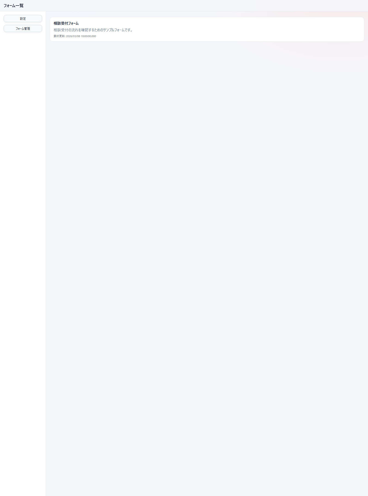

- 左側のサイドバーから `設定` と `フォーム管理` を開きます
- 右側には公開中のフォームがカード形式で並びます
- カードをクリックすると、そのフォームの検索画面へ移動します
- まだフォームが 1 件もない場合は、`フォーム管理` から新規作成します

---

## 2. 画面構成

### 2.1 設定

配色テーマや取り込み済みテーマを管理する画面です。

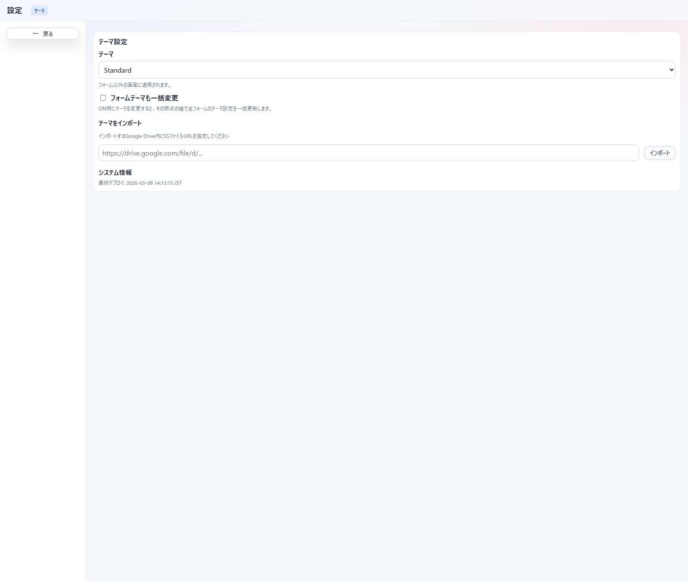

- `テーマ`: 画面全体の配色を切り替えます
- `フォームテーマも一括変更`: ON のとき、現在のテーマをフォーム側にもまとめて反映します
- `テーマをインポート`: Google Drive 上の CSS ファイル URL からカスタムテーマを取り込みます
- `システム情報`: 現在のデプロイ日時を確認できます

### 2.2 管理者設定

管理者キーやメールによるアクセス制御を設定する画面です。

- `管理者キー`: URL パラメータ `?adminkey=キー` でアクセスした場合のみ管理者として認識されます。空欄で制限なしになります
- `管理者メール`: 管理者として認識するメールアドレスを設定します。複数指定する場合は `;` 区切りです（例: `admin1@example.com;admin2@example.com`）
- `一般ユーザーが行ける範囲を個別フォームのみとする`: 管理者キーまたは管理者メールが設定されている場合に有効です。ON にすると、`?form=xxx` を指定しない一般ユーザーはアクセス拒否されます

> この画面は Google Apps Script 環境でのみ動作します。ローカル開発サーバーでは設定を保存できません。

### 2.3 フォーム管理

フォーム定義の一覧とメンテナンスを行う画面です。

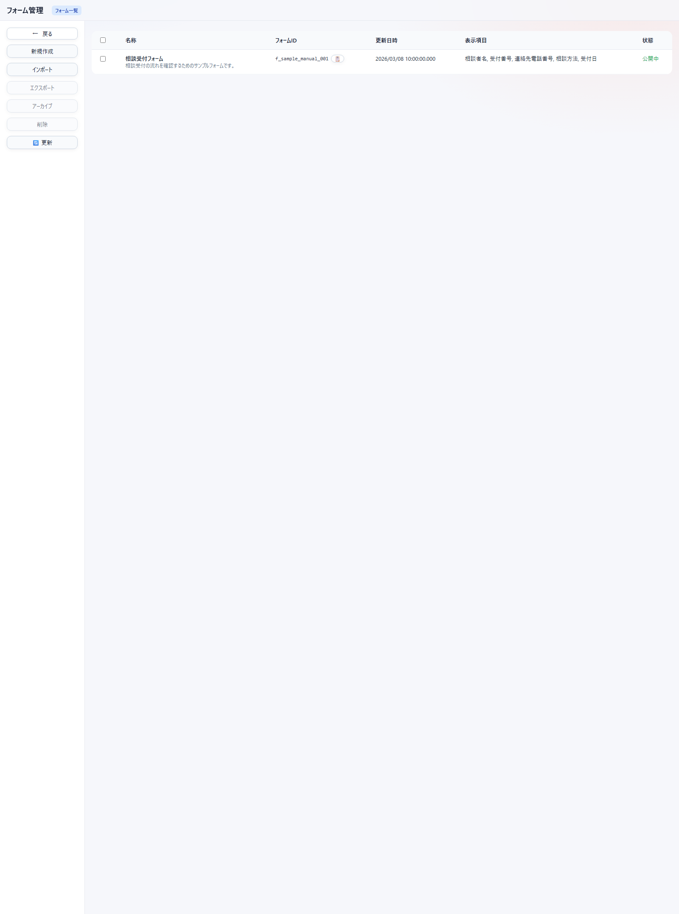

- `新規作成`: 新しいフォームを作成します
- `インポート`: Google Drive の URL からフォーム定義を取り込みます
- `エクスポート`: チェックしたフォームを JSON で出力します
- `アーカイブ`: 一覧から非表示にします
- `削除`: 一覧との紐付けを外します
- `更新`: 最新状態を再取得します
- 一覧の行をクリックすると、そのフォームの編集画面を開けます

### 2.4 Google Drive からのインポート

ファイル URL またはフォルダ URL を入力してフォームを登録します。

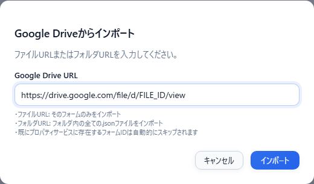

- ファイル URL: そのフォームのみ取り込みます
- フォルダ URL: フォルダ内の `.json` をまとめて取り込みます
- すでに登録済みのフォーム ID は自動的にスキップされます

### 2.5 フォーム編集

フォーム名、保存先、検索画面設定、アクセス制御、質問定義をまとめて編集する画面です。

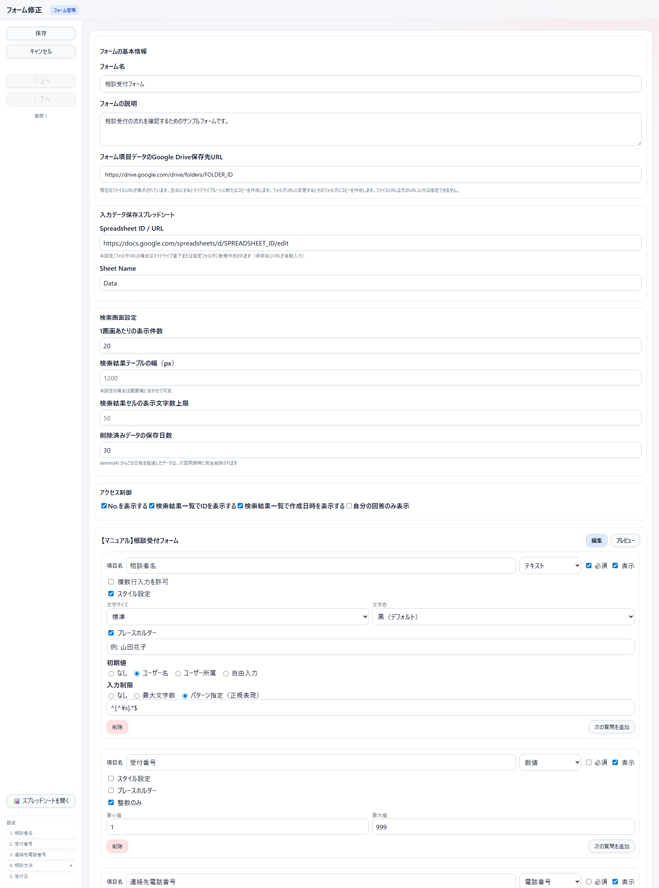

- 上部: フォーム名、説明、Google Drive 保存先 URL
- 中段: 回答保存先スプレッドシート、検索画面設定、レコード画面設定、アクセス制御、ファイル保存先設定
- 下段: 質問定義の編集エリア
- 左側: `保存`、`キャンセル`、選択中質問の上下移動、`スプレッドシートを開く`
- 左下: `質問一覧` から編集したい質問位置へ移動できます
- 右下タブ: `編集` / `プレビュー`

### 2.6 基本の質問カード

各質問はカード単位で編集します。

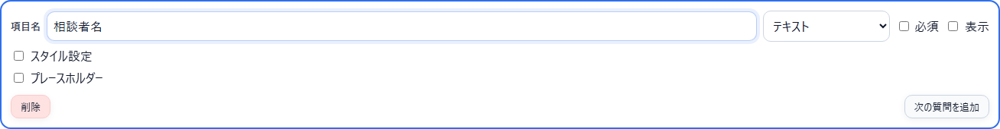

- `項目名`: 入力画面に表示するラベル
- `タイプ`: 入力形式
- `必須`: 未入力で保存できない項目にします
- `表示`: 検索結果や検索プレビューに出す項目を切り替えます
- `スタイル設定`: 文字サイズや文字色を調整します
- `プレースホルダー`: テキスト系入力欄に入力例を表示します
- `初期値`: テキスト型では「なし／入力者名／入力者所属／入力者役職／自由入力」を横並びで選択できます
- `入力制限`: テキスト型では「なし／最大文字数／パターン指定（正規表現）」を横並びで選択できます
- `次の質問を追加`: 同じ階層の次の質問を追加します

#### 数値型の追加設定

数値タイプを選択すると、以下の専用設定が表示されます。

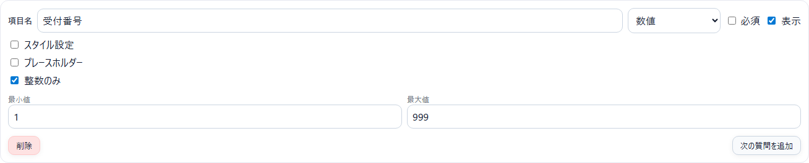

- `整数のみ`: チェックすると小数を受け付けません
- `最小値`: 入力できる数値の下限を設定します（空白で制限なし）
- `最大値`: 入力できる数値の上限を設定します（空白で制限なし）

#### 電話番号型の追加設定

電話番号タイプを選択すると、以下の専用設定が表示されます。

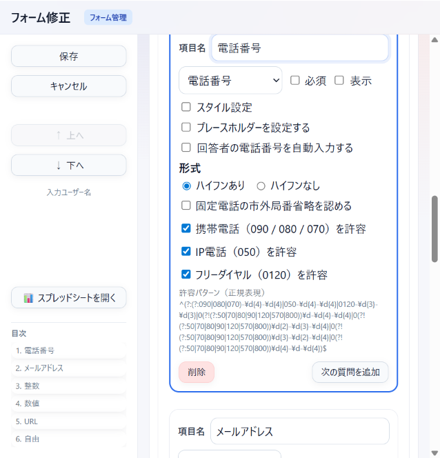

- `プレースホルダーを設定する`: ON にすると入力例を表示します。形式設定に連動した例が自動生成されます
- `入力者の電話番号を自動入力する`: チェックすると入力者のアカウント情報から電話番号を自動入力します
- `形式`: **ハイフンあり**（例: `090-1234-5678`）と**ハイフンなし**（例: `09012345678`）を切り替えます
- `固定電話の市外局番省略を認める`: チェックすると市外局番なしのローカル番号（例: `211-2111`）も受け付けます
- `携帯電話（090 / 080 / 070）を許容`: チェックすると携帯電話番号を受け付けます（デフォルト ON）
- `IP電話（050）を許容`: チェックすると IP 電話番号を受け付けます（デフォルト ON）
- `フリーダイヤル（0120）を許容`: チェックするとフリーダイヤルを受け付けます（デフォルト ON）
- `許容パターン（正規表現）`: 現在の設定から自動生成されたバリデーション用正規表現を確認できます

### 2.7 条件分岐付きの質問

ラジオ、チェックボックス、ドロップダウンでは選択肢ごとに子質問を追加できます。

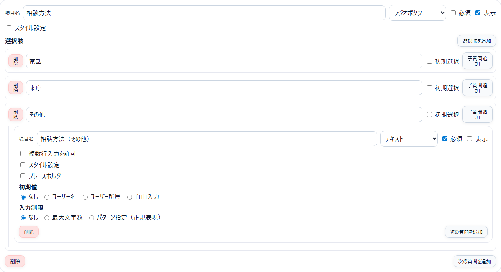

- `選択肢を追加`: 選択肢を増やします
- `子質問追加`: その選択肢が選ばれたときだけ表示する質問を追加します
- 子質問の中でも、通常の質問と同じようにタイプや必須設定を持てます

### 2.8 プレビュー

保存前に、入力画面と検索プレビューの見え方を確認できます。

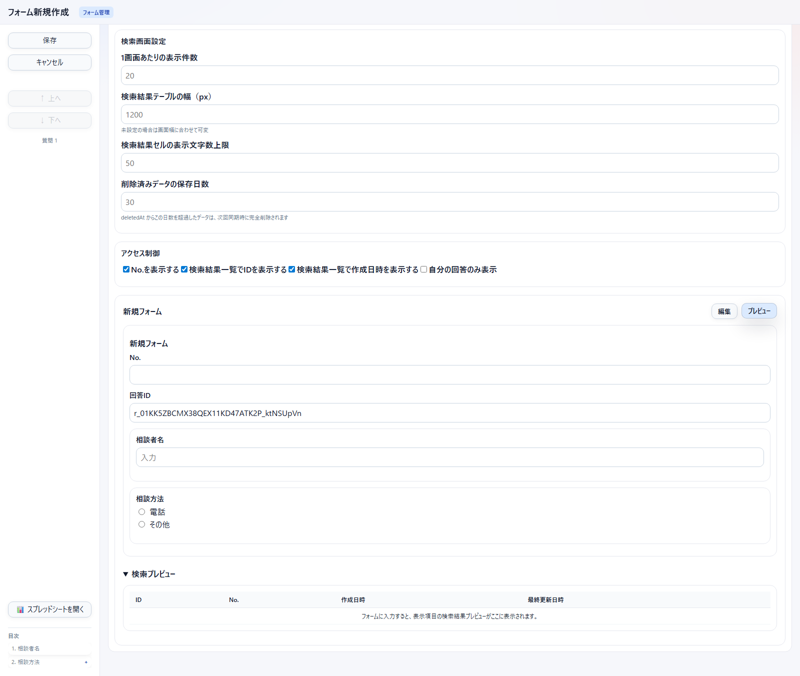

- 実際の入力欄に近い見た目で確認できます
- 上部で `No.` と `ID` の表示も確認できます
- 下部の `検索プレビュー` で、検索結果に出る列を確認できます
- 表示崩れや質問名の重複を保存前に見直せます

### 2.9 検索画面

保存済みデータの一覧表示、検索、削除、出力を行う画面です。

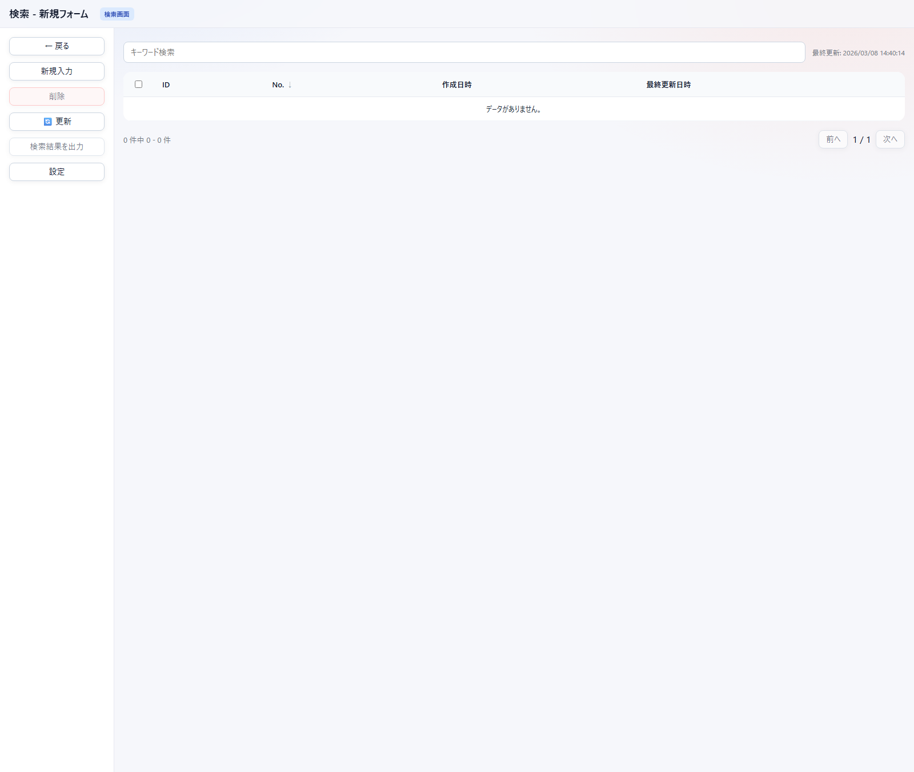

- `新規入力`: 新しいレコードを作成します
- `削除`: 選択したレコードを削除します
- `更新`: スプレッドシートとキャッシュを再同期します
- `検索結果を出力`: 表示中の結果を Excel で保存します
- `設定`: そのフォームの表示設定を開きます
- 一覧の行をクリックすると、そのレコードの閲覧・編集画面を開きます

### 2.10 フォーム入力画面

レコードの新規入力、閲覧、編集を行う画面です。

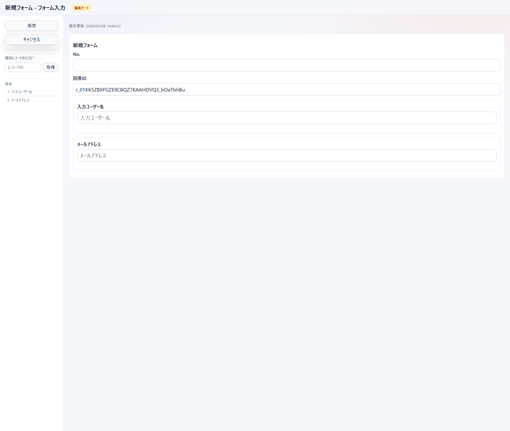

- 新規入力時は `保存` / `キャンセル`
- 画面上部に `No.` と `ID` が表示されます
- 左側の `既存レコードからコピー` で、レコード ID を指定して内容を流用できます
- 目次から任意の質問位置へ移動できます
- 保存前でも画面上で入力内容を確認できます

---

## 3. フォームを作成する

### 3.1 新規フォームを作る

1. `フォーム一覧` から `フォーム管理` を開きます。
2. `新規作成` を押します。
3. `フォーム名` と必要な保存先設定を入力します。
4. 質問カードを追加し、項目名やタイプを設定します。
5. `プレビュー` で見え方を確認します。
6. 問題なければ `保存` を押します。

### 3.2 基本情報の設定

フォーム編集画面では、まず次の項目を設定します。

| 項目 | 説明 |
| --- | --- |
| フォーム名 | 一覧や検索画面に表示される名前です |
| フォームの説明 | フォーム一覧カードの補足文です |
| フォーム項目データの Google Drive 保存先 URL | フォーム定義 JSON の保存先です |
| Spreadsheet ID / URL | 回答保存先のスプレッドシートです |
| Sheet Name | 回答を書き込むシート名です |

`フォーム項目データの Google Drive 保存先 URL` の扱い:

- 新規作成で空欄: マイドライブ直下に保存
- 新規作成でフォルダ URL: 指定フォルダに保存
- 新規作成でファイル URL: 指定不可
- 既存フォーム編集で空欄: 新しいコピーをマイドライブ直下に保存
- 既存フォーム編集でフォルダ URL: そのフォルダにコピーを保存

`Spreadsheet ID / URL` は次に対応します。

- スプレッドシート ID
- スプレッドシート URL
- Google Drive フォルダ URL
- 空欄

空欄またはフォルダ URL の場合は、保存時に新しいスプレッドシートが作成され、URL が自動入力されます。

### 3.3 検索画面設定

フォームごとに次の設定を持てます。

- `1画面あたりの表示件数`
- `検索結果テーブルの幅（px）`
- `検索結果セルの表示文字数上限`
- `削除済みデータの保存日数`

### 3.4 レコード画面設定

レコード（入力）画面の動作を設定します。

| 項目 | 説明 |
| --- | --- |
| 標準印刷テンプレートURL | Google ドキュメントの URL を指定します。未設定時は自動生成ドキュメントを使います |
| 標準様式出力ファイル名規則 | 出力ファイル名のテンプレートです。`{ID}`, `{_NOW}`, `{_NOW\|time:YYYY}`, `{フィールド名}` 等のトークンを使えます。既定値は `{ID}_{_NOW\|time:YYYY-MM-DD}` です |
| 通常保存後の動作 | 「一覧に戻る」または「レコード画面に留まる」を選べます |

### 3.5 アクセス制御

表示方法に関する次の切り替えがあります。

- `No.を表示する`
- `検索結果一覧でIDを表示する`
- `検索結果一覧で作成日時を表示する`
- `検索結果一覧で最終更新日時を表示する`
- `自分の回答のみ表示`

### 3.6 ファイル保存先設定

ファイルアップロードや様式出力で使用する Google Drive の保存先を設定します。

| 項目 | 説明 |
| --- | --- |
| ルートフォルダURL | ファイルの保存先となる Google Drive フォルダの URL です。空白の場合はマイドライブのルートになります |
| フォルダ命名規則 | レコードごとの子フォルダ名テンプレートです。`{ID}`, `{_NOW}`, `{_NOW\|time:YYYY}`, `{フィールド名}` 等のトークンを使えます。空白の場合は子フォルダを作らずルートフォルダ直下に保存します |

### 3.7 質問タイプ

質問タイプは次のとおりです。

| タイプ | 用途 |
| --- | --- |
| テキスト | 1 行または複数行の文字入力。入力制限として最大文字数またはパターン（正規表現）を指定可 |
| 電話番号 | 国内電話番号の入力。形式（ハイフンあり／なし）や許容する番号種別を細かく設定可 |
| メールアドレス | メール形式のみ受け付ける入力。入力者のアドレスを自動入力するオプションあり |
| URL | URL 形式のみ受け付ける入力 |
| 数値 | 数値のみ。整数制限・最小値・最大値を設定可 |
| 日付 | 日付入力。現在日付を初期値に設定するオプションあり |
| 時間 | 時刻入力。現在時刻を初期値に設定するオプションあり |
| 曜日 | 月〜日の固定選択肢。今日の曜日を初期値にするオプションあり |
| チェックボックス | 複数選択。選択肢ごとに子質問を追加可 |
| ラジオボタン | 単一選択。選択肢ごとに子質問を追加可 |
| ドロップダウン | プルダウン選択。選択肢ごとに子質問を追加可 |
| ファイルアップロード | ファイルを Google Drive にアップロード。URL アップロード・拡張子非表示・保存先変更の設定あり |
| 様式出力 | レコードを PDF または Gmail で出力するボタン。Google ドキュメントテンプレートの指定やファイル名規則の設定が可能 |
| メッセージ | 説明文や注意書きだけを表示する（入力なし） |

### 3.8 よく使う補助設定

- `複数行入力を許可`: テキストで利用できます。チェックすると長文入力欄になります
- `入力制限（最大文字数）`: テキストで利用できます。文字数の上限を設定します
- `入力制限（パターン指定）`: テキストで利用できます。正規表現パターンに合わない入力を拒否します
- `プレースホルダー`: テキスト系・数値・電話番号・URL で利用できます。電話番号では形式設定に合わせた例が自動生成されます
- `スタイル設定`: 文字サイズと文字色を質問ごとに設定できます
- `初期値（入力者名 / 入力者所属 / 入力者役職 / 自由入力）`: テキストで利用できます
- `初期値を現在の日付/時刻にする`: 日付・時間で利用できます
- `初期値を今日の曜日にする`: 曜日で利用できます
- `入力者のメールアドレスを自動入力する`: メールアドレスで利用できます
- `入力者の電話番号を自動入力する`: 電話番号で利用できます
- `整数のみ`: 数値で利用できます。チェックすると小数を拒否します
- `最小値 / 最大値`: 数値で利用できます。入力可能な範囲を制限します（空白で制限なし）
- `形式（ハイフンあり / なし）`: 電話番号で利用できます。保存・表示形式を切り替えます
- `許容番号種別`: 電話番号で利用できます。携帯・IP電話・フリーダイヤル・固定電話の市外局番省略を個別に ON / OFF できます

#### ファイルアップロードの追加設定

ファイルアップロードタイプを選択すると、以下の専用設定が表示されます。

- `URLによるアップロードを有効にする`: Google Drive 上のファイル URL を入力してアップロードできるようにします
- `保存先フォルダURLを変更可能にする`: 入力者がアップロード先フォルダを変更できるようにします
- `ファイル名の拡張子を非表示にする`: 検索結果や印刷プレビューでファイル名の拡張子を非表示にします

#### 様式出力の設定

様式出力タイプを選択すると、以下の設定が表示されます。

- `出力タイプ`: 「PDF」または「Gmail」を選択します
- `カスタムテンプレートを使う`（PDF のみ）: Google ドキュメント URL を指定してカスタムテンプレートで出力します
- `出力ファイル名`: ファイル名テンプレートを設定できます。未指定時はフォーム設定の標準様式出力ファイル名規則が使われます

Gmail を選択した場合は、以下の追加設定が表示されます。

- `To` / `Cc` / `Bcc`: 宛先を指定します。`{フィールド名}` でフォーム入力値を埋め込めます
- `件名`: メールの件名テンプレートです
- `本文`: メール本文テンプレートです。`{_folder_url}`、`{_record_url}`、`{_form_url}` などの特殊トークンも使えます
- `PDF を添付`: チェックすると、Gmail 下書きに PDF ファイルを添付します

### 3.9 テンプレート変換器リファレンス

ファイル名規則、フォルダ命名規則、Gmail テンプレート、Google ドキュメントテンプレートでは `{フィールド名}` でフォーム入力値を埋め込めます。さらに `|` の後に変換器を指定すると、値を加工して出力できます。

```text
{フィールド名|変換器:引数}
{フィールド名|変換器1:引数|変換器2:引数}   ← 左から順に適用
```

#### 予約トークン

テンプレート内でフィールド名の代わりに使えるシステムトークンです。

| トークン | 出力 |
| --- | --- |
| `{ID}` | レコード ID |
| `{_NOW}` | 現在日時（`YYYY-MM-DD HH:mm:ss` 形式）。`time:` パイプと組み合わせて任意の書式に整形できます |
| `{_folder_url}` | レコードの Drive フォルダ URL（Gmail 出力時のみ有効） |
| `{_record_url}` | レコード閲覧 URL（Gmail 出力時のみ有効） |
| `{_form_url}` | フォーム入力 URL（Gmail 出力時のみ有効） |

`{_NOW}` の使用例:

```text
{_NOW|time:YYYY年M月D日}     → 2026年4月4日
{_NOW|time:gge年M月D日}      → 令和8年4月4日
{_NOW|time:HH:mm}            → 10:20
{_NOW|time:YYYY/MM/DD(ddd)}  → 2026/04/04(土)
{_NOW|time:YYYY-MM-DD}       → 2026-04-04
```

#### 変換器一覧

##### 日付・時刻

| 変換器 | 構文例 | 出力例 | 説明 |
| --- | --- | --- | --- |
| `time` | `{生年月日\|time:YYYY/MM/DD}` | `2000/01/15` | 日付フォーマット |
| | `{生年月日\|time:gge年M月D日}` | `平成12年1月15日` | 和暦フォーマット |
| | `{入社日\|time:YYYY/MM/DD(ddd)}` | `2026/04/04(土)` | 曜日付き（ddd=短縮、dddd=完全） |
| | `{受付時間\|time:HH時mm分}` | `14時30分` | 時刻フォーマット |
| | `{受付時間\|time:HH:mm:ss}` | `14:30:00` | 秒付きフォーマット |

日付トークン: `YYYY`, `YY`, `MM`, `M`, `DD`, `D`, `gg`（元号）, `ee`, `e`, `ddd`（月）, `dddd`（月曜日）

時刻トークン: `HH`（0 埋め時）, `H`（時）, `mm`（0 埋め分）, `m`（分）, `ss`（0 埋め秒）, `s`（秒）

対応する入力形式: `YYYY-MM-DD`, `HH:mm`, `HH:mm:ss`, `YYYY-MM-DD HH:mm:ss` など。日付と時刻の両方を含む値では、日付トークンと時刻トークンの両方が使えます

##### 文字列

| 変換器 | 構文例 | 出力例 | 説明 |
| --- | --- | --- | --- |
| `left` | `{備考\|left:3}` | `あいう` | 先頭 N 文字を取得 |
| `right` | `{備考\|right:2}` | `えお` | 末尾 N 文字を取得 |
| `mid` | `{備考\|mid:1,3}` | `いうえ` | 位置と長さで部分文字列を取得 |
| `pad` | `{コード\|pad:6,0}` | `000123` | 左側を指定文字で埋める |
| `padRight` | `{コード\|padRight:10}` | `123       ` | 右側を指定文字で埋める（既定はスペース） |
| `upper` | `{コード\|upper}` | `ABCD` | 大文字に変換 |
| `lower` | `{コード\|lower}` | `abcd` | 小文字に変換 |
| `trim` | `{コード\|trim}` | `aBcD` | 前後の空白を除去 |
| `replace` | `{住所\|replace:-,/}` | `東京都/新宿区` | 文字列を全置換 |

##### 抽出

| 変換器 | 構文例 | 出力例 | 説明 |
| --- | --- | --- | --- |
| `match` | `{メール\|match:[^@]+}` | `user` | 正規表現でマッチした部分を取得 |
| | `{メール\|match:(.+)@(.+),2}` | `example.com` | グループ番号を指定して取得 |

グループ番号は最後のカンマの右側に指定します。省略時はマッチ全体（グループ 0）です。

##### 数値

| 変換器 | 構文例 | 出力例 | 説明 |
| --- | --- | --- | --- |
| `number` | `{金額\|number:#,##0}` | `1,234,567` | 3 桁区切り |
| | `{割合\|number:0.00}` | `3.14` | 小数点以下 2 桁 |
| | `{金額\|number:#,##0円}` | `1,234,567円` | 接尾辞付き |

##### 条件

| 変換器 | 構文例 | 出力例 | 説明 |
| --- | --- | --- | --- |
| `if` | `{性別\|if:男,Mr.,Ms.}` | `Mr.` / `Ms.` | 値が一致すれば THEN、それ以外は ELSE |
| | `{備考\|if:,あり,なし}` | `あり` / `なし` | 空文字指定で値の有無を判定 |
| `default` | `{電話\|default:未入力}` | `未入力` | 値が空のときにフォールバック |
| `map` | `{評価\|map:A=優;B=良;C=可;*=不明}` | `優` | 値を別の文字列に変換。`*` はデフォルト |

##### 文字変換

| 変換器 | 構文例 | 出力例 | 説明 |
| --- | --- | --- | --- |
| `kana` | `{名前\|kana}` | `ヤマダ タロウ` | ひらがなをカタカナに変換 |
| `zen` | `{テキスト\|zen}` | `ＡＢＣ　１２３` | 半角を全角に変換（半角カナの濁音にも対応） |
| `han` | `{テキスト\|han}` | `ABC 123` | 全角を半角に変換 |

#### エスケープ

テンプレート内でリテラル文字として使いたい場合は `\` でエスケープします。

| 記法 | 意味 |
| --- | --- |
| `\{` / `\}` | リテラルの `{` / `}` |
| `\|` | 変換器の区切りではなくリテラルの `\|` |

#### ファイルアップロードフィールドの出し分け

ファイルアップロードの値は URL 文字列（未アップロード時は空）です。`default` 変換器で出し分けできます。

```text
{添付ファイル|default:なし}   → URLがあればURL、なければ「なし」
```

### 3.10 保存前の確認

- `プレビュー` で入力画面を確認します
- `表示` を ON にした項目が検索プレビューに出ているか確認します
- 項目名の重複や未設定ラベルがないか確認します

---

## 4. データを扱う

### 4.1 検索する

検索ボックスでは、単純検索と条件検索の両方を使えます。

#### 基本

```text
山田
```

- すべての列を対象に部分一致検索します

#### 列を指定する

```text
相談者名:山田
```

#### 比較する

```text
No.>=10
受付日>=2026/03/01
```

使える演算子:

- `=`
- `!=`
- `>`
- `>=`
- `<`
- `<=`

#### 正規表現を使う

```text
相談者名:/^山田/
```

#### 条件を組み合わせる

```text
相談者名:山田 AND 受付日>=2026/03/01
```

```text
(問合せ方法:電話 OR 問合せ方法:メール) 担当者:山田
```

補足:

- 半角スペース / 全角スペース区切りは暗黙の `AND` として扱われます
- `AND`、`OR`、`()` を使って条件を組み合わせられます

### 4.2 新規入力・編集・コピー

- `新規入力`: 新しいレコードを作成します
- `保存`: 入力内容を保存します
- `キャンセル`: 編集前の状態に戻します
- `既存レコードからコピー`: レコード ID を指定して内容を流用します
- 一覧から開いたレコードは、画面遷移せずに内容を確認・編集できます

### 4.3 削除と復元

- 検索画面でチェックしたレコードを `削除` できます
- `削除済みデータを表示する` を ON にすると、削除済みデータも一覧に出せます
- 削除済みレコードだけを選択すると `削除取消し` に切り替わり、復元できます
- 完全削除は、フォーム設定の `削除済みデータの保存日数` を超えた後の同期時に行われます

### 4.4 検索結果を出力する

検索画面の `検索結果を出力` を押すと、表示中の結果が Excel ファイルとして Google Drive に保存されます。

- ファイル名は `検索結果_フォーム名_日時.xlsx`
- 完了後に `ファイルを開く` リンクが表示されます

---

## 5. クイックスタート

### 5.1 最短手順

1. `フォーム管理` で `新規作成` を押します。
2. `フォーム名` を入れます。
3. 1 つ目の質問に `相談者名`、タイプ `テキスト` を設定します。
4. 2 つ目の質問に `相談方法`、タイプ `ラジオ` を設定します。
5. `電話` と `その他` を追加し、`その他` に `子質問追加` を行います。
6. `プレビュー` で確認して保存します。
7. `検索画面` から `新規入力` で回答を登録します。

---

## 6. よくある質問

### Q1. フォーム定義はどこに保存されますか？

`フォーム項目データの Google Drive 保存先 URL` で指定した Google Drive 上に JSON として保存されます。

### Q2. 回答データはどこに保存されますか？

`Spreadsheet ID / URL` で指定した Google スプレッドシートです。未設定やフォルダ URL の場合は自動作成されます。

### Q3. フォーム一覧から削除すると、Drive 上のファイルも消えますか？

いいえ。現在の `削除` は一覧との紐付けを外す操作で、Drive 上のフォームファイル自体は残ります。

### Q4. なぜ専用の権限設定画面が出ないのですか？

このデプロイは `User Properties` モードで運用しているためです。フォーム一覧や設定は利用者ごとに保持されます。

### Q5. 検索結果に出す列はどこで決めますか？

各質問カードの `表示` を ON にした項目です。`プレビュー` タブ下部の `検索プレビュー` でも確認できます。

---

## 7. トラブルシューティング

### フォームが保存できない

- `フォーム名` が空欄になっていないか確認します
- 同じ項目名が重複していないか確認します
- Google Drive 保存先 URL の形式が正しいか確認します
- スプレッドシート ID / URL の形式が正しいか確認します

### 検索結果が更新されない

- `更新` を押して最新データを取得します
- 画面上部の最終更新表示に `(キャッシュ)` が付く場合は、表示中データがローカルキャッシュです
- 同期直後は数秒待ってから再度確認します

### インポートできない

- Google Drive のファイル URL またはフォルダ URL になっているか確認します
- JSON ファイルが壊れていないか確認します
- 同じフォーム ID がすでに登録済みでないか確認します

### 画面が開かない、または保存先へアクセスできない

- Google Drive / Google スプレッドシートへの権限があるか確認します
- ブラウザを再読み込みして再試行します
- 別の Google アカウントで開いていないか確認します

### テーマが反映されない

- ブラウザを再読み込みします
- インポートした CSS の URL が正しいか確認します
- 変更後も反映されない場合は別ブラウザでも確認します

---

## 8. サポート時に伝える情報

問題が解決しない場合は、次の情報を添えて連絡してください。

- 発生日時
- 対象フォーム名
- 操作した画面
- 表示されたエラーメッセージ
- ブラウザ名とバージョン

---

**最終更新**: 2026年4月8日（バージョン 3.1）
**作成**: Nested Form Builder Development Team
